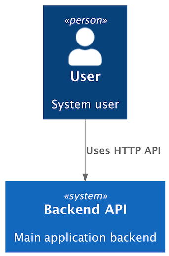

## Getting Started

Diagrams can be defined using the [Python DSL](concepts/diagrams.md) or
a [JSON representation](converters/json/json.md).

### Python Example

Create a diagram using the Python DSL:

```python
# diagram.py
from c4 import Person, Rel, System, SystemContextDiagram

with SystemContextDiagram() as diagram:
    user = Person("User", "System user")
    backend = System("Backend API", "Main application backend")

    user >> Rel("Uses HTTP API") >> backend
```

<br/>

To render the diagram to text (by default, PlantUML source), run:

```shell
c4 render diagram.py > diagram.puml
```

<details>
<summary>Generated PlantUML source</summary>

```puml
@startuml
' convert it with additional command line argument -DRELATIVE_INCLUDE="relative/absolute" to use locally
!if %variable_exists("RELATIVE_INCLUDE")
    !include %get_variable_value("RELATIVE_INCLUDE")/C4_Context.puml
!else
    !include https://raw.githubusercontent.com/plantuml-stdlib/C4-PlantUML/master/C4_Context.puml
!endif

Person(user_a467, "User", "System user")

System(backend_api_8c20, "Backend API", "Main application backend")

Rel(user_a467, backend_api_8c20, "Uses HTTP API")

@enduml
```

</details>

<br/>

To export the diagram to a rendered artifact (by default, PNG format), run:

```shell
c4 export diagram.py > diagram.png
```

This generates the diagram below:

<figure markdown="span">
  { width="300" }
  <figcaption>diagram.png</figcaption>
</figure>

### JSON Support

Diagrams can also be defined in [JSON format](converters/json/json.md).

The same diagram expressed in JSON:

```json
{
  "type": "SystemContextDiagram",
  "elements": [
    {
      "type": "Person",
      "alias": "user",
      "label": "User",
      "description": "System user"
    },
    {
      "type": "System",
      "alias": "app",
      "label": "Backend API",
      "description": "Main application backend"
    }
  ],
  "relationships": [
    {
      "type": "REL",
      "from": "user",
      "to": "app",
      "label": "Uses HTTP API"
    }
  ]
}
```

JSON diagrams are treated the same way as Python diagrams:

- `c4 render diagram.json` — generate textual output (e.g. PlantUML)
- `c4 export diagram.json` — generate rendered artifacts (e.g. PNG)
- `c4 convert diagram.json` — convert to another representation (e.g. Python)

<br/>

To convert a JSON diagram into the Python DSL, run:

```shell
c4 convert diagram.json --json-to-py > diagram.py
```

This generates:

```python
# diagram.py
from c4 import (
    Person,
    Rel,
    System,
    SystemContextDiagram,
)

with SystemContextDiagram() as diagram:
    user = Person('User', 'System user', alias='user')
    app = System('Backend API', 'Main application backend', alias='app')
    user >> Rel('Uses HTTP API') >> app
```

<br/>

## Diagram Targets

The `render` and `export` commands accept a diagram target. For Python targets,
the optional name after `:` selects a specific diagram object in the file or
module. If no name is provided, the CLI auto-detects a diagram only when the target
has **exactly one** module-level
diagram.

The `convert` command currently supports JSON input targets for
JSON-to-Python conversion.

| Syntax                                                          | Meaning                                                    | Example                                                                               |
|-----------------------------------------------------------------|------------------------------------------------------------|---------------------------------------------------------------------------------------|
| <span style="white-space: nowrap;">`file.py`</span>             | Auto-detect the single diagram in a Python file.           | <span style="white-space: nowrap;">`c4 render diagrams/context.py`</span>             |
| <span style="white-space: nowrap;">`file.py:diagram`</span>     | Load a named diagram variable from a Python file.          | <span style="white-space: nowrap;">`c4 render diagrams/context.py:public_api`</span>  |
| <span style="white-space: nowrap;">`module.path`</span>         | Import a Python module and auto-detect its single diagram. | <span style="white-space: nowrap;">`c4 render architecture.context`</span>            |
| <span style="white-space: nowrap;">`module.path:diagram`</span> | Import a Python module and load a named diagram variable.  | <span style="white-space: nowrap;">`c4 render architecture.context:public_api`</span> |
| <span style="white-space: nowrap;">`file.json`</span>           | Load a JSON diagram.                                       | <span style="white-space: nowrap;">`c4 render diagrams/context.json`</span>           |

## Examples

Render PlantUML source to stdout:

```shell
c4 render diagram.py --plantuml
```

Render Mermaid source:

```shell
c4 render diagram.py --mermaid -o diagram.mmd
```

Render D2 source:

```shell
c4 render diagram.py --d2 -o diagram.d2
```

Select a named diagram in a Python file:

```shell
c4 render diagrams.py:container_diagram -o container.puml
```

Export SVG with Mermaid:

```shell
c4 export diagram.py --mermaid -f svg -o diagram.svg
```

Export SVG with D2 using ELK layout:

```shell
c4 export diagram.py --d2 --d2-layout elk -f svg -o diagram.svg
```

Export SVG with a remote PlantUML server:

```shell
c4 export diagram.py --plantuml -f svg \
  --plantuml-backend remote \
  --plantuml-server-url https://www.plantuml.com/plantuml \
  -o diagram.svg
```

Export PNG with local PlantUML and the bundled C4-PlantUML files:

```shell
c4 export diagram.py --plantuml -f png \
  --plantuml-use-bundled-c4-plantuml true \
  -o diagram.png
```

## Watch Mode

The `render` and `export` commands can re-run automatically when watched files
change. Watch mode is an optional dependency:

```shell
pip install "c4-diagrams[watch]"
```

Watch mode writes on every rerun, so `--watch` requires `-o` / `--output`.

Render PlantUML source whenever the diagram file changes:

```shell
c4 render diagram.py --plantuml -o diagram.puml --watch
```

Export an SVG whenever the diagram file changes:

```shell
c4 export diagram.py --mermaid -f svg -o diagram.svg --watch
```

Use `--watch-dir` for shared reusable diagram element directories. Without
`--watch-include`, any changed file under that directory triggers a rerun:

```shell
c4 export diagram.py -f svg -o diagram.svg --watch --watch-dir shared_package
```

Use `--watch-include` to narrow which files under `--watch-dir` trigger a
rerun:

```shell
c4 render diagram.py -o diagram.puml --watch \
  --watch-dir shared_package \
  --watch-include "*.py"
```

The current implementation watches the primary target file and any explicit
`--watch-dir` paths. It does not infer or follow the Python import graph, so
helper modules should be covered with `--watch-dir` and, optionally,
`--watch-include`.

!!! warning

    `c4 export` writes binary bytes to stdout when `-o` / `--output` is not
    provided. Use `-o` for PNG, SVG, PDF, EPS, and other rendered artifacts to
    avoid writing binary data directly to your terminal.

## Environment Variables

CLI flags take precedence over environment variables.

| Variable                                                              | Used by                                                          | Description                                                                                              | Default                                           |
|-----------------------------------------------------------------------|------------------------------------------------------------------|----------------------------------------------------------------------------------------------------------|---------------------------------------------------|
| <span style="white-space: nowrap;">`PLANTUML_SERVER_URL`</span>       | <span style="white-space: nowrap;">`c4 export --plantuml`</span> | PlantUML server URL for <span style="white-space: nowrap;">`--plantuml-backend remote`</span>.           | [plantuml.com](https://www.plantuml.com/plantuml) |
| <span style="white-space: nowrap;">`PLANTUML_BIN`</span>              | <span style="white-space: nowrap;">`c4 export --plantuml`</span> | Local PlantUML executable when <span style="white-space: nowrap;">`--plantuml-jar`</span> is not set.    | `plantuml`                                        |
| <span style="white-space: nowrap;">`PLANTUML_JAR`</span>              | <span style="white-space: nowrap;">`c4 export --plantuml`</span> | Local PlantUML JAR path. Takes precedence over <span style="white-space: nowrap;">`PLANTUML_BIN`</span>. | None                                              |
| <span style="white-space: nowrap;">`JAVA_BIN`</span>                  | <span style="white-space: nowrap;">`c4 export --plantuml`</span> | Java executable used with <span style="white-space: nowrap;">`--plantuml-jar`</span>.                    | `java`                                            |
| <span style="white-space: nowrap;">`PLANTUML_SKINPARAM_DPI`</span>    | <span style="white-space: nowrap;">`c4 export --plantuml`</span> | Injects <span style="white-space: nowrap;">`skinparam dpi`</span> for PlantUML rendering.                | None                                              |
| <span style="white-space: nowrap;">`MERMAID_BIN`</span>               | <span style="white-space: nowrap;">`c4 export --mermaid`</span>  | Local Mermaid CLI executable.                                                                            | `mmdc`                                            |
| <span style="white-space: nowrap;">`MERMAID_SCALE_FACTOR`</span>      | <span style="white-space: nowrap;">`c4 export --mermaid`</span>  | Mermaid CLI Puppeteer scale factor.                                                                      | `1`                                               |
| <span style="white-space: nowrap;">`D2_BIN`</span>                    | <span style="white-space: nowrap;">`c4 export --d2`</span>       | Local D2 executable.                                                                                     | `d2`                                              |
| <span style="white-space: nowrap;">`RENDERING_TIMEOUT_SECONDS`</span> | <span style="white-space: nowrap;">`c4 export`</span>            | Render timeout in seconds.                                                                               | `30.0`                                            |

## CLI Reference

### c4 render

Render a diagram to text output (by default, PlantUML source).

**Usage:**

```shell
c4 render [-h] [-o OUTPUT] \
          [--renderer {plantuml,mermaid,d2} | --plantuml | --mermaid | --d2] \
          [--plantuml-use-new-c4-style] \
          [-w] [--watch-delay WATCH_DELAY] \
          [--watch-dir WATCH_DIR] [--watch-include WATCH_INCLUDE] \
          target
```

**Arguments:**

| Name     | Type   | Description                                                                                                                                                                             |
|----------|--------|-----------------------------------------------------------------------------------------------------------------------------------------------------------------------------------------|
| `target` | string | [Diagram target](#diagram-targets): Python file or module (`file.py`, `file.py:diagram`, `module.path`, `module.path:diagram`) or a [JSON file](converters/json/json.md) (`file.json`). |

**Options**:

| Name                                                       | Type                                 | Description                                                                                             | Default    |
|------------------------------------------------------------|--------------------------------------|---------------------------------------------------------------------------------------------------------|------------|
| `--renderer`                                               | choice (`plantuml`, `mermaid`, `d2`) | Renderer to use (overrides the diagram's default renderer).                                             | `plantuml` |
| `--plantuml`                                               | boolean                              | Use PlantUML renderer <br/> (alias for <span style="white-space: nowrap;">`--renderer plantuml`</span>) | False      |
| `--mermaid`                                                | boolean                              | Use Mermaid renderer <br/> (alias for <span style="white-space: nowrap;">`--renderer mermaid`</span>)   | False      |
| `--d2`                                                     | boolean                              | Use D2 renderer <br/> (alias for <span style="white-space: nowrap;">`--renderer d2`</span>)             | False      |
| <span style="white-space: nowrap;">`-o`, `--output`</span> | path                                 | Redirect output to a file.                                                                              | stdout     |
| `-h`, `--help`                                             | boolean                              | Show this help message and exit.                                                                        | False      |

**Watch Options**:

These options require the `watch` extra and apply only to `render` and
`export`. `--watch` requires `-o` / `--output`.

| Name                                                                  | Type    | Description                                                                                             | Default |
|-----------------------------------------------------------------------|---------|---------------------------------------------------------------------------------------------------------|---------|
| <span style="white-space: nowrap;">`-w`, `--watch`</span>             | boolean | Re-run the command when watched files change.                                                           | False   |
| <span style="white-space: nowrap;">`--watch-delay`</span>             | float   | Delay in seconds before re-running after a relevant change.                                             | 0.25    |
| <span style="white-space: nowrap;">`--watch-dir`</span>               | path    | Additional directory to watch for reusable diagram elements or helper files. Can be repeated.           | None    |
| <span style="white-space: nowrap;">`--watch-include`</span>           | string  | Pattern for relevant changes under `--watch-dir`, matched with `Path.match`. Can be repeated.           | None    |

**PlantUML Options**:

These options apply when using the **plantuml** renderer.

| Name                                                                    | Type    | Description                          | Default |
|-------------------------------------------------------------------------|---------|--------------------------------------|---------|
| <span style="white-space: nowrap;">`--plantuml-use-new-c4-style`</span> | boolean | Activates the new C4-PlantUML style. | False   |

<br/>

### c4 export

Export a diagram to a rendered artifact (e.g., PNG or SVG).

The available formats depend on the selected `renderer`.

!!! note

    Requires [system dependencies](installation.md#system-dependencies).

**Usage:**

```shell
c4 export [-h] [-o OUTPUT] [-f {eps,latex,pdf,png,svg,txt,utxt}] \
          [--timeout TIMEOUT] \
          [--renderer {plantuml,mermaid,d2} | --plantuml | --mermaid | --d2] \
          [--plantuml-backend {local,remote}] \
          [--plantuml-server-url PLANTUML_SERVER_URL] \
          [--plantuml-bin PLANTUML_BIN | --plantuml-jar PLANTUML_JAR] \
          [--java-bin JAVA_BIN] \
          [--plantuml-skinparam-dpi PLANTUML_SKINPARAM_DPI] \
          [--plantuml-use-new-c4-style] \
          [--plantuml-use-bundled-c4-plantuml PLANTUML_USE_BUNDLED_C4_PLANTUML] \
          [--mermaid-bin MERMAID_BIN] \
          [--mermaid-scale-factor MERMAID_SCALE_FACTOR] \
          [--mermaid-puppeteer-headless MERMAID_PUPPETEER_HEADLESS | \
           --mermaid-puppeteer-config MERMAID_PUPPETEER_CONFIG] \
          [--d2-bin D2_BIN] [--d2-layout {dagre,elk}] \
          [-w] [--watch-delay WATCH_DELAY] \
          [--watch-dir WATCH_DIR] [--watch-include WATCH_INCLUDE] \
          target
```

**Arguments:**

| Name     | Type   | Description                                                                                                                                                                             |
|----------|--------|-----------------------------------------------------------------------------------------------------------------------------------------------------------------------------------------|
| `target` | string | [Diagram target](#diagram-targets): Python file or module (`file.py`, `file.py:diagram`, `module.path`, `module.path:diagram`) or a [JSON file](converters/json/json.md) (`file.json`). |

**Options**:

| Name                                                       | Type                                                        | Description                                                                                                                                             | Default    |
|------------------------------------------------------------|-------------------------------------------------------------|---------------------------------------------------------------------------------------------------------------------------------------------------------|------------|
| <span style="white-space: nowrap;">`-f`, `--format`</span> | choice (`eps`, `latex`, `pdf`, `png`, `svg`, `txt`, `utxt`) | Output format (render-specific).<br/>Supported formats:<br/>`d2`: `pdf`, `png`, `svg`<br/>`mermaid`: `pdf`, `png`, `svg`<br/>`plantuml`: `eps`, `latex`, `png`, `svg`, `txt`, `utxt`. | `png`      |
| `--timeout`                                                | float                                                       | Render timeout in seconds.<br/>Can also be set via the `RENDERING_TIMEOUT_SECONDS` environment variable.                                                | 30.0       |
| `--renderer`                                               | choice (`plantuml`, `mermaid`, `d2`)                         | Renderer to use (overrides the diagram's default renderer).                                                                                             | `plantuml` |
| `--plantuml`                                               | boolean                                                     | Use PlantUML renderer <br/> (alias for <span style="white-space: nowrap;">`--renderer plantuml`</span>).                                                | False      |
| `--mermaid`                                                | boolean                                                     | Use Mermaid renderer <br/> (alias for <span style="white-space: nowrap;">`--renderer mermaid`</span>).                                                  | False      |
| `--d2`                                                     | boolean                                                     | Use D2 renderer <br/> (alias for <span style="white-space: nowrap;">`--renderer d2`</span>).                                                            | False      |
| <span style="white-space: nowrap;">`-o`, `--output`</span> | path                                                        | Redirect output to a file.                                                                                                                              | `stdout`   |
| `-h`, `--help`                                             | boolean                                                     | Show this help message and exit.                                                                                                                        | False      |

**Watch Options**:

These options require the `watch` extra and apply only to `render` and
`export`. `--watch` requires `-o` / `--output`.

| Name                                                                  | Type    | Description                                                                                             | Default |
|-----------------------------------------------------------------------|---------|---------------------------------------------------------------------------------------------------------|---------|
| <span style="white-space: nowrap;">`-w`, `--watch`</span>             | boolean | Re-run the command when watched files change.                                                           | False   |
| <span style="white-space: nowrap;">`--watch-delay`</span>             | float   | Delay in seconds before re-running after a relevant change.                                             | 0.25    |
| <span style="white-space: nowrap;">`--watch-dir`</span>               | path    | Additional directory to watch for reusable diagram elements or helper files. Can be repeated.           | None    |
| <span style="white-space: nowrap;">`--watch-include`</span>           | string  | Pattern for relevant changes under `--watch-dir`, matched with `Path.match`. Can be repeated.           | None    |

**PlantUML Options**:

These options apply when using the **plantuml** renderer.

| Name                                                                           | Type                           | Description                                                                                                                                                                                                           | Default                                           |
|--------------------------------------------------------------------------------|--------------------------------|-----------------------------------------------------------------------------------------------------------------------------------------------------------------------------------------------------------------------|---------------------------------------------------|
| <span style="white-space: nowrap;">`--plantuml-backend`</span>                 | choice (`local`, `remote`)     | How to run PlantUML: local execution or remote server.                                                                                                                                                                | `local`                                           |
| <span style="white-space: nowrap;">`--plantuml-server-url`</span>              | string                         | PlantUML server URL.<br/>If not provided, the `PLANTUML_SERVER_URL` environment variable will be used.                                                                                                                | [plantuml.com](https://www.plantuml.com/plantuml) |
| <span style="white-space: nowrap;">`--plantuml-bin`</span>                     | string (path or command)       | PlantUML executable (command name or full path).<br/>If not provided, the `PLANTUML_BIN` environment variable will be used.                                                                                           | `plantuml`                                        |
| <span style="white-space: nowrap;">`--plantuml-jar`</span>                     | path                           | Path to the PlantUML JAR file (runs via Java).<br/>If provided, the `PLANTUML_BIN` environment variable is ignored.<br/>Can also be set via the `PLANTUML_JAR` environment variable.                                  | None                                              |
| <span style="white-space: nowrap;">`--java-bin`</span>                         | string (path or command)       | Java executable to use when running PlantUML via JAR.<br/>If not provided, the `JAVA_BIN` environment variable will be used.                                                                                          | `java`                                            |
| <span style="white-space: nowrap;">`--plantuml-skinparam-dpi`</span>           | integer                        | Set PlantUML `skinparam dpi` value to control raster (PNG) resolution.<br/>This modifies diagram rendering and affects all output formats.<br/>Can also be set via the `PLANTUML_SKINPARAM_DPI` environment variable. | None                                              |
| <span style="white-space: nowrap;">`--plantuml-use-new-c4-style`</span>        | boolean                        | Activates the new C4-PlantUML style.                                                                                                                                                                                  | False                                             |
| <span style="white-space: nowrap;">`--plantuml-use-bundled-c4-plantuml`</span> | boolean value (`true`/`false`) | Use [bundled C4-PlantUML library](https://github.com/plantuml-stdlib/C4-PlantUML#including-the-c4-plantuml-library) files instead of fetching them from remote sources.                                               | **True**                                          |

**Mermaid Options**:

These options apply when using the **mermaid** renderer.

| Name                                                                     | Type                     | Description                                                                                                                                                    | Default |
|--------------------------------------------------------------------------|--------------------------|----------------------------------------------------------------------------------------------------------------------------------------------------------------|---------|
| <span style="white-space: nowrap;">`--mermaid-bin`</span>                | string (path or command) | Mermaid executable (command name or full path).<br/>If not provided, the `MERMAID_BIN` environment variable will be used.                                      | `mmdc`  |
| <span style="white-space: nowrap;">`--mermaid-scale-factor`</span>       | integer                  | Set Mermaid scale value to control Puppeteer scale factor.<br/>Can also be set via the `MERMAID_SCALE_FACTOR` environment variable.                            | 1       |
| <span style="white-space: nowrap;">`--mermaid-puppeteer-headless`</span> | boolean                  | Generate a temporary Puppeteer config with the provided `headless` value and pass it to Mermaid CLI.<br/>Mutually exclusive with `--mermaid-puppeteer-config`. | None    |
| <span style="white-space: nowrap;">`--mermaid-puppeteer-config`</span>   | path                     | Path to a Puppeteer config passed to Mermaid CLI.<br/>Mutually exclusive with `--mermaid-puppeteer-headless`.                                                  | None    |

**D2 Options**:

These options apply when using the **d2** renderer.

| Name                                                   | Type                     | Description                                                                                       | Default |
|--------------------------------------------------------|--------------------------|---------------------------------------------------------------------------------------------------|---------|
| <span style="white-space: nowrap;">`--d2-bin`</span>   | string (path or command) | D2 executable (command name or full path).<br/>If not provided, the `D2_BIN` environment variable will be used. | `d2`    |
| <span style="white-space: nowrap;">`--d2-layout`</span> | choice (`dagre`, `elk`)  | D2 layout engine for exported artifacts. When omitted, `D2RenderOptions.layout` is used and defaults to `dagre`. When provided, this flag overrides diagram or renderer render options. | None    |

### c4 convert

Convert a diagram from one representation to another.

!!! note

    Requires [additional dependencies](installation.md#optional-dependencies).

**Usage:**

```shell
c4 convert [-h] \
           [--json-to-py] \
           [--from {json} | --from-json] \
           [--to {py} | --to-py] \
           [-o OUTPUT] \
           target
```

**Arguments:**

| Name     | Type   | Description     |
|----------|--------|-----------------|
| `target` | string | Diagram target. |

**Options:**

| Name             | Type            | Description                                                                     | Default  |
|------------------|-----------------|---------------------------------------------------------------------------------|----------|
| `--from`         | choice (`json`) | Input format.                                                                   | —        |
| `--to`           | choice (`py`)   | Output format.                                                                  | —        |
| `--from-json`    | flag            | Convert from [JSON diagram](converters/json/json.md) (alias for `--from json`). | False    |
| `--to-py`        | flag            | Convert to Python DSL (alias for `--to py`).                                    | False    |
| `--json-to-py`   | flag            | Shortcut for `--from json --to py`.                                             | False    |
| `-o`, `--output` | path            | Redirect output to a file.                                                      | `stdout` |
| `-h`, `--help`   | flag            | Show this help message and exit.                                                | False    |
