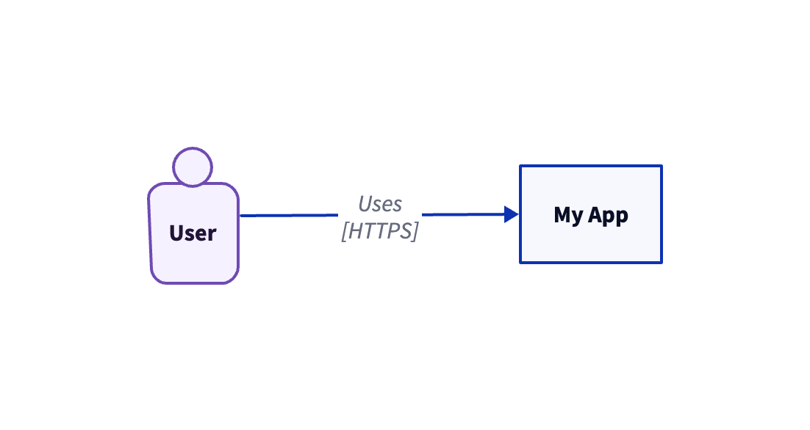
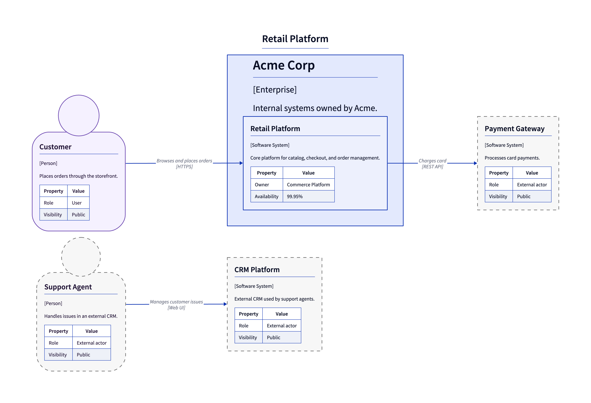

# D2 SystemContextDiagram Spec

> **Source:** [d2.system-context-diagram.json](../../../assets/specs/d2.system-context-diagram.json)


This schema describes the [SystemContextDiagram][c4.diagrams.system_context.SystemContextDiagram] spec for the D2 backend.

## Properties

???+ info "Properties"

    <div class="code-nowrap"></div>

    | Field | Type | Description |
    |---|---|---|
    | **`type(required)`** | `string` | Type of the diagram. Must be exactly `SystemContextDiagram`. |
    | `title` | <span style="white-space: nowrap;">`string` \| `null`</span> | Optional diagram title. |
    | `elements` | <code>array[<a href="#elements">Element</a>]</code> | Top-level elements. |
    | `boundaries` | <code>array[<a href="#boundaries">Boundary</a>]</code> | Top-level boundaries. |
    | `relationships` | <code>array[<a href="#d2relationshipschema">D2RelationshipSchema</a>]</code> | Top-level relationships. |
    | `render_options` | <code><a href="#d2renderoptionsschema">D2RenderOptionsSchema</a></code> | D2-specific render options. |
    | **`backend(required)`** | `string` | JSON schema backend. Must be exactly `d2`. |

??? abstract "Examples"

    === "Minimal"

        ??? example "JSON source"

            ```json
            --8<-- "assets/examples/json/d2/system-context-diagram.minimal.json"
            ```

        ??? example "Rendered D2 source"

            ```d2
            --8<-- "assets/examples/d2/system-context-diagram.minimal.d2"
            ```

        ??? example "Rendered image"

            <figure markdown="span">
            
            </figure>


    === "Advanced"

        ??? example "JSON source"

            ```json
            --8<-- "assets/examples/json/d2/system-context-diagram.advanced.json"
            ```

        ??? example "Rendered D2 source"

            ```d2
            --8<-- "assets/examples/d2/system-context-diagram.advanced.d2"
            ```

        ??? example "Rendered image"

            <figure markdown="span">
            
            </figure>


### Elements

- [D2PersonSchema](#d2personschema)
- [D2PersonExtSchema](#d2personextschema)
- [D2SystemSchema](#d2systemschema)
- [D2SystemExtSchema](#d2systemextschema)
- [D2SystemDbSchema](#d2systemdbschema)
- [D2SystemDbExtSchema](#d2systemdbextschema)
- [D2SystemQueueSchema](#d2systemqueueschema)
- [D2SystemQueueExtSchema](#d2systemqueueextschema)

### Boundaries

- [D2BoundarySchema](#d2boundaryschema)
- [D2EnterpriseBoundarySchema](#d2enterpriseboundaryschema)
- [D2SystemBoundarySchema](#d2systemboundaryschema)

### Relationships

- [D2RelationshipSchema](#d2relationshipschema)

- [D2RelationshipSchema types](#relationshiptype)

## Definitions


???+ warning "About **labels** and **aliases**"

    `label` is a display name for the element.

    `alias` is a unique identifier used for referencing elements
    in relationships and layouts.
    If omitted, it is generated automatically.


    You can also use `label` for referencing elements in relationships     and layouts, but each `label` must be **unique** within the diagram.


<br/>

### D2BoundarySchema

D2 JSON schema for a generic boundary.

???+ info "Properties"

    <div class="code-nowrap"></div>

    | Field | Type | Description |
    |---|---|---|
    | **`type(required)`** | `string` | Discriminator identifying the element type. Must be exactly `Boundary`. |
    | `elements` | <code>array[<a href="#elements">Element</a>]</code> | Elements nested inside this boundary. |
    | `boundaries` | <code>array[<a href="#boundaries">Boundary</a>]</code> | Boundaries nested inside this boundary. |
    | `relationships` | <code>array[<a href="#d2relationshipschema">D2RelationshipSchema</a>]</code> | Relationships declared inside this boundary. |
    | `alias` | <span style="white-space: nowrap;">`string` \| `null`</span> | Unique identifier for the element. If not provided, it is autogenerated from the label. |
    | `classes` | <code>array[string]</code> | Optional D2 classes. |
    | `description` | <span style="white-space: nowrap;">`string` \| `null`</span> | Optional description text. |
    | `direction` | <span style="white-space: nowrap;"><code>enum[up \| down \| left \| right]</code> \| `null`</span> | Optional D2 layout direction for a container. |
    | `icon` | <span style="white-space: nowrap;">`string` \| `null`</span> | Optional D2 icon URL. |
    | **`label(required)`** | `string` | Display name for the element. |
    | `link` | <span style="white-space: nowrap;">`string` \| `null`</span> | Optional D2 link URL. |
    | `near` | <span style="white-space: nowrap;">`string` \| `null`</span> | Optional D2 near reference. |
    | `properties` | <code><a href="#diagramelementpropertiesschema">DiagramElementPropertiesSchema</a></code> | Optional property table metadata. |
    | `shape` | <span style="white-space: nowrap;">`string` \| `null`</span> | Optional D2 shape. |
    | `style` | <code><a href="#d2styleschema">D2StyleSchema</a></code> | Optional D2 style attributes. |
    | `tooltip` | <span style="white-space: nowrap;">`string` \| `null`</span> | Optional D2 tooltip. |

### D2EnterpriseBoundarySchema

D2 JSON schema for an enterprise boundary.

???+ info "Properties"

    <div class="code-nowrap"></div>

    | Field | Type | Description |
    |---|---|---|
    | **`type(required)`** | `string` | Discriminator identifying the element type. Must be exactly `EnterpriseBoundary`. |
    | `elements` | <code>array[<a href="#elements">Element</a>]</code> | Elements nested inside this boundary. |
    | `boundaries` | <code>array[<a href="#boundaries">Boundary</a>]</code> | Boundaries nested inside this boundary. |
    | `relationships` | <code>array[<a href="#d2relationshipschema">D2RelationshipSchema</a>]</code> | Relationships declared inside this boundary. |
    | `alias` | <span style="white-space: nowrap;">`string` \| `null`</span> | Unique identifier for the element. If not provided, it is autogenerated from the label. |
    | `classes` | <code>array[string]</code> | Optional D2 classes. |
    | `description` | <span style="white-space: nowrap;">`string` \| `null`</span> | Optional description text. |
    | `direction` | <span style="white-space: nowrap;"><code>enum[up \| down \| left \| right]</code> \| `null`</span> | Optional D2 layout direction for a container. |
    | `icon` | <span style="white-space: nowrap;">`string` \| `null`</span> | Optional D2 icon URL. |
    | **`label(required)`** | `string` | Display name for the element. |
    | `link` | <span style="white-space: nowrap;">`string` \| `null`</span> | Optional D2 link URL. |
    | `near` | <span style="white-space: nowrap;">`string` \| `null`</span> | Optional D2 near reference. |
    | `properties` | <code><a href="#diagramelementpropertiesschema">DiagramElementPropertiesSchema</a></code> | Optional property table metadata. |
    | `shape` | <span style="white-space: nowrap;">`string` \| `null`</span> | Optional D2 shape. |
    | `style` | <code><a href="#d2styleschema">D2StyleSchema</a></code> | Optional D2 style attributes. |
    | `tooltip` | <span style="white-space: nowrap;">`string` \| `null`</span> | Optional D2 tooltip. |

### D2PersonExtSchema

D2 JSON schema for an external person.

???+ info "Properties"

    <div class="code-nowrap"></div>

    | Field | Type | Description |
    |---|---|---|
    | **`type(required)`** | `string` | Discriminator identifying the element type. Must be exactly `PersonExt`. |
    | `alias` | <span style="white-space: nowrap;">`string` \| `null`</span> | Unique identifier for the element. If not provided, it is autogenerated from the label. |
    | `classes` | <code>array[string]</code> | Optional D2 classes. |
    | `description` | <span style="white-space: nowrap;">`string` \| `null`</span> | Optional description text. |
    | `direction` | <span style="white-space: nowrap;"><code>enum[up \| down \| left \| right]</code> \| `null`</span> | Optional D2 layout direction for a container. |
    | `icon` | <span style="white-space: nowrap;">`string` \| `null`</span> | Optional D2 icon URL. |
    | **`label(required)`** | `string` | Display name for the element. |
    | `link` | <span style="white-space: nowrap;">`string` \| `null`</span> | Optional D2 link URL. |
    | `near` | <span style="white-space: nowrap;">`string` \| `null`</span> | Optional D2 near reference. |
    | `properties` | <code><a href="#diagramelementpropertiesschema">DiagramElementPropertiesSchema</a></code> | Optional property table metadata. |
    | `shape` | <span style="white-space: nowrap;">`string` \| `null`</span> | Optional D2 shape. |
    | `style` | <code><a href="#d2styleschema">D2StyleSchema</a></code> | Optional D2 style attributes. |
    | `tooltip` | <span style="white-space: nowrap;">`string` \| `null`</span> | Optional D2 tooltip. |

### D2PersonSchema

D2 JSON schema for a person.

???+ info "Properties"

    <div class="code-nowrap"></div>

    | Field | Type | Description |
    |---|---|---|
    | **`type(required)`** | `string` | Discriminator identifying the element type. Must be exactly `Person`. |
    | `alias` | <span style="white-space: nowrap;">`string` \| `null`</span> | Unique identifier for the element. If not provided, it is autogenerated from the label. |
    | `classes` | <code>array[string]</code> | Optional D2 classes. |
    | `description` | <span style="white-space: nowrap;">`string` \| `null`</span> | Optional description text. |
    | `direction` | <span style="white-space: nowrap;"><code>enum[up \| down \| left \| right]</code> \| `null`</span> | Optional D2 layout direction for a container. |
    | `icon` | <span style="white-space: nowrap;">`string` \| `null`</span> | Optional D2 icon URL. |
    | **`label(required)`** | `string` | Display name for the element. |
    | `link` | <span style="white-space: nowrap;">`string` \| `null`</span> | Optional D2 link URL. |
    | `near` | <span style="white-space: nowrap;">`string` \| `null`</span> | Optional D2 near reference. |
    | `properties` | <code><a href="#diagramelementpropertiesschema">DiagramElementPropertiesSchema</a></code> | Optional property table metadata. |
    | `shape` | <span style="white-space: nowrap;">`string` \| `null`</span> | Optional D2 shape. |
    | `style` | <code><a href="#d2styleschema">D2StyleSchema</a></code> | Optional D2 style attributes. |
    | `tooltip` | <span style="white-space: nowrap;">`string` \| `null`</span> | Optional D2 tooltip. |

### D2RelationshipSchema

JSON schema for relationships supported by D2 C4 diagrams.

???+ info "Properties"

    <div class="code-nowrap"></div>

    | Field | Type | Description |
    |---|---|---|
    | **`type(required)`** | <code><a href="#relationshiptype">RelationshipType</a></code> | Type of the relationship. |
    | `classes` | <code>array[string]</code> | Optional D2 classes. |
    | `description` | <span style="white-space: nowrap;">`string` \| `null`</span> | Additional details about the relationship. |
    | **`from(required)`** | `string` | The source element alias (or unique label). |
    | `icon` | <span style="white-space: nowrap;">`string` \| `null`</span> | Optional D2 icon URL. |
    | **`label(required)`** | `string` | The label shown on the relationship edge. |
    | `link` | <span style="white-space: nowrap;">`string` \| `null`</span> | Optional D2 link URL. |
    | `near` | <span style="white-space: nowrap;">`string` \| `null`</span> | Optional D2 near reference. |
    | `properties` | <code><a href="#diagramelementpropertiesschema">DiagramElementPropertiesSchema</a></code> | Optional property table metadata. |
    | `style` | <code><a href="#d2styleschema">D2StyleSchema</a></code> | Optional D2 style attributes. |
    | `technology` | <span style="white-space: nowrap;">`string` \| `null`</span> | The technology used in the communication. |
    | **`to(required)`** | `string` | The destination element alias (or unique label). |
    | `tooltip` | <span style="white-space: nowrap;">`string` \| `null`</span> | Optional D2 tooltip. |

### RelationshipType

Relationship types supported by D2 C4 diagrams.

???+ info "Items"

    <div class="code-nowrap"></div>

    | Type | Description |
    |---|---|
    | `BI_REL` | A bidirectional relationship between two elements. |
    | `REL` | A unidirectional relationship between two elements. |

### D2SystemBoundarySchema

D2 JSON schema for a system boundary.

???+ info "Properties"

    <div class="code-nowrap"></div>

    | Field | Type | Description |
    |---|---|---|
    | **`type(required)`** | `string` | Discriminator identifying the element type. Must be exactly `SystemBoundary`. |
    | `elements` | <code>array[<a href="#elements">Element</a>]</code> | Elements nested inside this boundary. |
    | `boundaries` | <code>array[<a href="#boundaries">Boundary</a>]</code> | Boundaries nested inside this boundary. |
    | `relationships` | <code>array[<a href="#d2relationshipschema">D2RelationshipSchema</a>]</code> | Relationships declared inside this boundary. |
    | `alias` | <span style="white-space: nowrap;">`string` \| `null`</span> | Unique identifier for the element. If not provided, it is autogenerated from the label. |
    | `classes` | <code>array[string]</code> | Optional D2 classes. |
    | `description` | <span style="white-space: nowrap;">`string` \| `null`</span> | Optional description text. |
    | `direction` | <span style="white-space: nowrap;"><code>enum[up \| down \| left \| right]</code> \| `null`</span> | Optional D2 layout direction for a container. |
    | `icon` | <span style="white-space: nowrap;">`string` \| `null`</span> | Optional D2 icon URL. |
    | **`label(required)`** | `string` | Display name for the element. |
    | `link` | <span style="white-space: nowrap;">`string` \| `null`</span> | Optional D2 link URL. |
    | `near` | <span style="white-space: nowrap;">`string` \| `null`</span> | Optional D2 near reference. |
    | `properties` | <code><a href="#diagramelementpropertiesschema">DiagramElementPropertiesSchema</a></code> | Optional property table metadata. |
    | `shape` | <span style="white-space: nowrap;">`string` \| `null`</span> | Optional D2 shape. |
    | `style` | <code><a href="#d2styleschema">D2StyleSchema</a></code> | Optional D2 style attributes. |
    | `tooltip` | <span style="white-space: nowrap;">`string` \| `null`</span> | Optional D2 tooltip. |

### D2SystemDbExtSchema

D2 JSON schema for an external database-like system.

???+ info "Properties"

    <div class="code-nowrap"></div>

    | Field | Type | Description |
    |---|---|---|
    | **`type(required)`** | `string` | Discriminator identifying the element type. Must be exactly `SystemDbExt`. |
    | `alias` | <span style="white-space: nowrap;">`string` \| `null`</span> | Unique identifier for the element. If not provided, it is autogenerated from the label. |
    | `classes` | <code>array[string]</code> | Optional D2 classes. |
    | `description` | <span style="white-space: nowrap;">`string` \| `null`</span> | Optional description text. |
    | `direction` | <span style="white-space: nowrap;"><code>enum[up \| down \| left \| right]</code> \| `null`</span> | Optional D2 layout direction for a container. |
    | `icon` | <span style="white-space: nowrap;">`string` \| `null`</span> | Optional D2 icon URL. |
    | **`label(required)`** | `string` | Display name for the element. |
    | `link` | <span style="white-space: nowrap;">`string` \| `null`</span> | Optional D2 link URL. |
    | `near` | <span style="white-space: nowrap;">`string` \| `null`</span> | Optional D2 near reference. |
    | `properties` | <code><a href="#diagramelementpropertiesschema">DiagramElementPropertiesSchema</a></code> | Optional property table metadata. |
    | `shape` | <span style="white-space: nowrap;">`string` \| `null`</span> | Optional D2 shape. |
    | `style` | <code><a href="#d2styleschema">D2StyleSchema</a></code> | Optional D2 style attributes. |
    | `tooltip` | <span style="white-space: nowrap;">`string` \| `null`</span> | Optional D2 tooltip. |

### D2SystemDbSchema

D2 JSON schema for a database-like system.

???+ info "Properties"

    <div class="code-nowrap"></div>

    | Field | Type | Description |
    |---|---|---|
    | **`type(required)`** | `string` | Discriminator identifying the element type. Must be exactly `SystemDb`. |
    | `alias` | <span style="white-space: nowrap;">`string` \| `null`</span> | Unique identifier for the element. If not provided, it is autogenerated from the label. |
    | `classes` | <code>array[string]</code> | Optional D2 classes. |
    | `description` | <span style="white-space: nowrap;">`string` \| `null`</span> | Optional description text. |
    | `direction` | <span style="white-space: nowrap;"><code>enum[up \| down \| left \| right]</code> \| `null`</span> | Optional D2 layout direction for a container. |
    | `icon` | <span style="white-space: nowrap;">`string` \| `null`</span> | Optional D2 icon URL. |
    | **`label(required)`** | `string` | Display name for the element. |
    | `link` | <span style="white-space: nowrap;">`string` \| `null`</span> | Optional D2 link URL. |
    | `near` | <span style="white-space: nowrap;">`string` \| `null`</span> | Optional D2 near reference. |
    | `properties` | <code><a href="#diagramelementpropertiesschema">DiagramElementPropertiesSchema</a></code> | Optional property table metadata. |
    | `shape` | <span style="white-space: nowrap;">`string` \| `null`</span> | Optional D2 shape. |
    | `style` | <code><a href="#d2styleschema">D2StyleSchema</a></code> | Optional D2 style attributes. |
    | `tooltip` | <span style="white-space: nowrap;">`string` \| `null`</span> | Optional D2 tooltip. |

### D2SystemExtSchema

D2 JSON schema for an external software system.

???+ info "Properties"

    <div class="code-nowrap"></div>

    | Field | Type | Description |
    |---|---|---|
    | **`type(required)`** | `string` | Discriminator identifying the element type. Must be exactly `SystemExt`. |
    | `alias` | <span style="white-space: nowrap;">`string` \| `null`</span> | Unique identifier for the element. If not provided, it is autogenerated from the label. |
    | `classes` | <code>array[string]</code> | Optional D2 classes. |
    | `description` | <span style="white-space: nowrap;">`string` \| `null`</span> | Optional description text. |
    | `direction` | <span style="white-space: nowrap;"><code>enum[up \| down \| left \| right]</code> \| `null`</span> | Optional D2 layout direction for a container. |
    | `icon` | <span style="white-space: nowrap;">`string` \| `null`</span> | Optional D2 icon URL. |
    | **`label(required)`** | `string` | Display name for the element. |
    | `link` | <span style="white-space: nowrap;">`string` \| `null`</span> | Optional D2 link URL. |
    | `near` | <span style="white-space: nowrap;">`string` \| `null`</span> | Optional D2 near reference. |
    | `properties` | <code><a href="#diagramelementpropertiesschema">DiagramElementPropertiesSchema</a></code> | Optional property table metadata. |
    | `shape` | <span style="white-space: nowrap;">`string` \| `null`</span> | Optional D2 shape. |
    | `style` | <code><a href="#d2styleschema">D2StyleSchema</a></code> | Optional D2 style attributes. |
    | `tooltip` | <span style="white-space: nowrap;">`string` \| `null`</span> | Optional D2 tooltip. |

### D2SystemQueueExtSchema

D2 JSON schema for an external queue-like system.

???+ info "Properties"

    <div class="code-nowrap"></div>

    | Field | Type | Description |
    |---|---|---|
    | **`type(required)`** | `string` | Discriminator identifying the element type. Must be exactly `SystemQueueExt`. |
    | `alias` | <span style="white-space: nowrap;">`string` \| `null`</span> | Unique identifier for the element. If not provided, it is autogenerated from the label. |
    | `classes` | <code>array[string]</code> | Optional D2 classes. |
    | `description` | <span style="white-space: nowrap;">`string` \| `null`</span> | Optional description text. |
    | `direction` | <span style="white-space: nowrap;"><code>enum[up \| down \| left \| right]</code> \| `null`</span> | Optional D2 layout direction for a container. |
    | `icon` | <span style="white-space: nowrap;">`string` \| `null`</span> | Optional D2 icon URL. |
    | **`label(required)`** | `string` | Display name for the element. |
    | `link` | <span style="white-space: nowrap;">`string` \| `null`</span> | Optional D2 link URL. |
    | `near` | <span style="white-space: nowrap;">`string` \| `null`</span> | Optional D2 near reference. |
    | `properties` | <code><a href="#diagramelementpropertiesschema">DiagramElementPropertiesSchema</a></code> | Optional property table metadata. |
    | `shape` | <span style="white-space: nowrap;">`string` \| `null`</span> | Optional D2 shape. |
    | `style` | <code><a href="#d2styleschema">D2StyleSchema</a></code> | Optional D2 style attributes. |
    | `tooltip` | <span style="white-space: nowrap;">`string` \| `null`</span> | Optional D2 tooltip. |

### D2SystemQueueSchema

D2 JSON schema for a queue-like system.

???+ info "Properties"

    <div class="code-nowrap"></div>

    | Field | Type | Description |
    |---|---|---|
    | **`type(required)`** | `string` | Discriminator identifying the element type. Must be exactly `SystemQueue`. |
    | `alias` | <span style="white-space: nowrap;">`string` \| `null`</span> | Unique identifier for the element. If not provided, it is autogenerated from the label. |
    | `classes` | <code>array[string]</code> | Optional D2 classes. |
    | `description` | <span style="white-space: nowrap;">`string` \| `null`</span> | Optional description text. |
    | `direction` | <span style="white-space: nowrap;"><code>enum[up \| down \| left \| right]</code> \| `null`</span> | Optional D2 layout direction for a container. |
    | `icon` | <span style="white-space: nowrap;">`string` \| `null`</span> | Optional D2 icon URL. |
    | **`label(required)`** | `string` | Display name for the element. |
    | `link` | <span style="white-space: nowrap;">`string` \| `null`</span> | Optional D2 link URL. |
    | `near` | <span style="white-space: nowrap;">`string` \| `null`</span> | Optional D2 near reference. |
    | `properties` | <code><a href="#diagramelementpropertiesschema">DiagramElementPropertiesSchema</a></code> | Optional property table metadata. |
    | `shape` | <span style="white-space: nowrap;">`string` \| `null`</span> | Optional D2 shape. |
    | `style` | <code><a href="#d2styleschema">D2StyleSchema</a></code> | Optional D2 style attributes. |
    | `tooltip` | <span style="white-space: nowrap;">`string` \| `null`</span> | Optional D2 tooltip. |

### D2SystemSchema

D2 JSON schema for a software system.

???+ info "Properties"

    <div class="code-nowrap"></div>

    | Field | Type | Description |
    |---|---|---|
    | **`type(required)`** | `string` | Discriminator identifying the element type. Must be exactly `System`. |
    | `alias` | <span style="white-space: nowrap;">`string` \| `null`</span> | Unique identifier for the element. If not provided, it is autogenerated from the label. |
    | `classes` | <code>array[string]</code> | Optional D2 classes. |
    | `description` | <span style="white-space: nowrap;">`string` \| `null`</span> | Optional description text. |
    | `direction` | <span style="white-space: nowrap;"><code>enum[up \| down \| left \| right]</code> \| `null`</span> | Optional D2 layout direction for a container. |
    | `icon` | <span style="white-space: nowrap;">`string` \| `null`</span> | Optional D2 icon URL. |
    | **`label(required)`** | `string` | Display name for the element. |
    | `link` | <span style="white-space: nowrap;">`string` \| `null`</span> | Optional D2 link URL. |
    | `near` | <span style="white-space: nowrap;">`string` \| `null`</span> | Optional D2 near reference. |
    | `properties` | <code><a href="#diagramelementpropertiesschema">DiagramElementPropertiesSchema</a></code> | Optional property table metadata. |
    | `shape` | <span style="white-space: nowrap;">`string` \| `null`</span> | Optional D2 shape. |
    | `style` | <code><a href="#d2styleschema">D2StyleSchema</a></code> | Optional D2 style attributes. |
    | `tooltip` | <span style="white-space: nowrap;">`string` \| `null`</span> | Optional D2 tooltip. |

### DiagramElementPropertiesSchema

JSON schema for tabular diagram element properties.

???+ info "Properties"

    <div class="code-nowrap"></div>

    | Field | Type | Description |
    |---|---|---|
    | `header` | <code>array[string]</code> | Header columns. Default: `["Property", "Value"]`. |
    | **`properties(required)`** | <code>array[array[string]]</code> | List of rows (each row is a list of string values). |
    | `show_header` | `boolean` | Whether to display the header row. Default: `true`. |


## D2 Render Options


### D2RenderOptionsSchema

Render options for the D2 renderer.

???+ info "Properties"

    <div class="code-nowrap"></div>

    | Field | Type | Description |
    |---|---|---|
    | `auto_number_relationships` | `boolean` | Auto Number Relationships Default: `false`. |
    | `bidirectional_relationships` | <code>enum[two_edges \| single_edge]</code> | Bidirectional Relationships Default: `two_edges`. |
    | `direction` | <span style="white-space: nowrap;"><code>enum[up \| down \| left \| right]</code> \| `null`</span> | Direction Default: `right`. |
    | `fully_qualified_relationships` | `boolean` | Fully Qualified Relationships Default: `true`. |
    | `include_properties` | `boolean` | Include Properties Default: `false`. |
    | `include_technology` | `boolean` | Include Technology Default: `true`. |
    | `include_type_label` | `boolean` | Include Type Label Default: `true`. |
    | `layout` | <code>enum[dagre \| elk]</code> | Layout Default: `dagre`. |
    | `legend` | <code><a href="#d2legendschema">D2LegendSchema</a></code> |  |
    | `sequence_diagram` | `boolean` | Sequence Diagram Default: `false`. |
    | `theme` | <span style="white-space: nowrap;">`integer` \| `null`</span> | Theme |
    | `title_near` | <span style="white-space: nowrap;"><code>enum[top-left \| top-center \| top-right \| center-left \| center-right \| bottom-left \| bottom-center \| bottom-right]</code> \| `null`</span> | Title Near Default: `top-center`. |

### D2StyleSchema

D2 style attributes used by D2 render options.

???+ info "Properties"

    <div class="code-nowrap"></div>

    | Field | Type | Description |
    |---|---|---|
    | `animated` | <span style="white-space: nowrap;">`boolean` \| `null`</span> | Animated |
    | `bold` | <span style="white-space: nowrap;">`boolean` \| `null`</span> | Bold |
    | `border_radius` | <span style="white-space: nowrap;">`integer` \| `null`</span> | Border Radius |
    | `double_border` | <span style="white-space: nowrap;">`boolean` \| `null`</span> | Double Border |
    | `fill` | <span style="white-space: nowrap;">`string` \| `null`</span> | Fill |
    | `fill_pattern` | <span style="white-space: nowrap;">`string` \| `null`</span> | Fill Pattern |
    | `font` | <span style="white-space: nowrap;">`string` \| `null`</span> | Font |
    | `font_color` | <span style="white-space: nowrap;">`string` \| `null`</span> | Font Color |
    | `font_size` | <span style="white-space: nowrap;">`integer` \| `null`</span> | Font Size |
    | `italic` | <span style="white-space: nowrap;">`boolean` \| `null`</span> | Italic |
    | `multiple` | <span style="white-space: nowrap;">`boolean` \| `null`</span> | Multiple |
    | `opacity` | <span style="white-space: nowrap;">`number` \| `null`</span> | Opacity |
    | `shadow` | <span style="white-space: nowrap;">`boolean` \| `null`</span> | Shadow |
    | `stroke` | <span style="white-space: nowrap;">`string` \| `null`</span> | Stroke |
    | `stroke_dash` | <span style="white-space: nowrap;">`integer` \| `null`</span> | Stroke Dash |
    | `stroke_width` | <span style="white-space: nowrap;">`integer` \| `null`</span> | Stroke Width |
    | `text_transform` | <span style="white-space: nowrap;">`string` \| `null`</span> | Text Transform |
    | `three_d` | <span style="white-space: nowrap;">`boolean` \| `null`</span> | Three D |
    | `underline` | <span style="white-space: nowrap;">`boolean` \| `null`</span> | Underline |

### D2LegendSchema

Structured D2 legend render options.

???+ info "Properties"

    <div class="code-nowrap"></div>

    | Field | Type | Description |
    |---|---|---|
    | `items` | <code>array[<code><a href="#d2legendelementschema">D2LegendElementSchema</a></code>\|<code><a href="#d2legendrelschema">D2LegendRelSchema</a></code>]</code> | Items |
    | `label` | `string` | Label Default: `Legend`. |

### D2LegendElementSchema

Schema for a D2 legend node sample.

???+ info "Properties"

    <div class="code-nowrap"></div>

    | Field | Type | Description |
    |---|---|---|
    | **`type(required)`** | `string` | Legend item discriminator. Must be exactly `element`. |
    | `alias` | <span style="white-space: nowrap;">`string` \| `null`</span> | Optional D2 identifier. |
    | `classes` | <code>array[string]</code> | Classes |
    | `icon` | <span style="white-space: nowrap;">`string` \| `null`</span> | Icon |
    | **`label(required)`** | `string` | Legend item label. |
    | `shape` | <span style="white-space: nowrap;">`string` \| `null`</span> | Shape |
    | `style` | <code><a href="#d2styleschema">D2StyleSchema</a></code> |  |

### D2LegendRelSchema

Schema for a D2 legend relationship sample.

???+ info "Properties"

    <div class="code-nowrap"></div>

    | Field | Type | Description |
    |---|---|---|
    | **`type(required)`** | `string` | Legend item discriminator. Must be exactly `relationship`. |
    | `alias` | <span style="white-space: nowrap;">`string` \| `null`</span> | Optional D2 identifier. |
    | `bidirectional` | `boolean` | Bidirectional Default: `false`. |
    | `classes` | <code>array[string]</code> | Classes |
    | `hide_endpoints` | <span style="white-space: nowrap;">`boolean` \| `null`</span> | Hide Endpoints |
    | **`label(required)`** | `string` | Legend item label. |
    | `source` | <span style="white-space: nowrap;">`string` \| `null`</span> | Source |
    | `style` | <code><a href="#d2styleschema">D2StyleSchema</a></code> |  |
    | `target` | <span style="white-space: nowrap;">`string` \| `null`</span> | Target |
