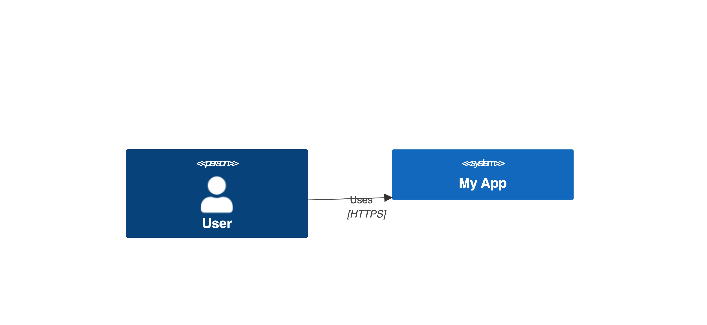
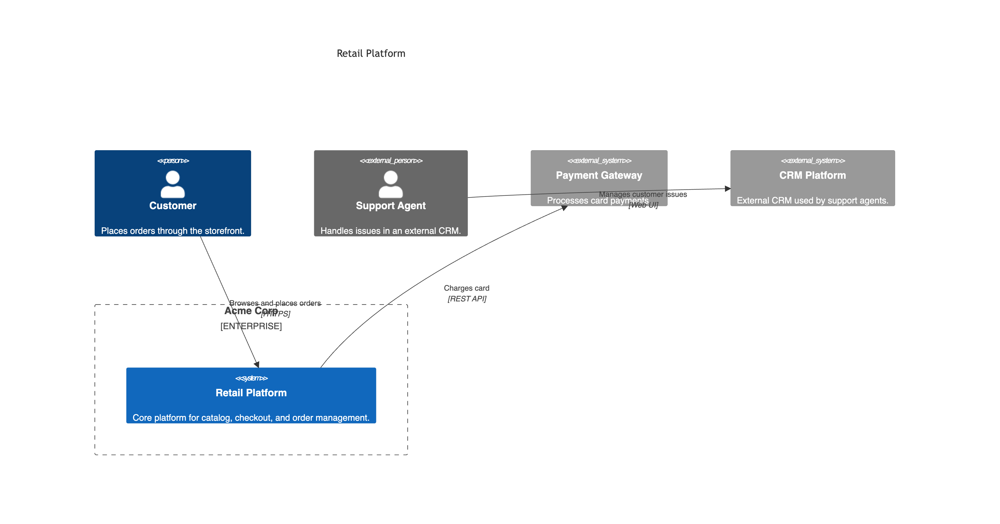

# Mermaid SystemContextDiagram Spec

> **Source:** [mermaid.system-context-diagram.json](../../../assets/specs/mermaid.system-context-diagram.json)


This schema describes the [SystemContextDiagram][c4.diagrams.system_context.SystemContextDiagram] spec for the Mermaid backend.

## Properties

???+ info "Properties"

    <div class="code-nowrap"></div>

    | Field | Type | Description |
    |---|---|---|
    | **`type(required)`** | `string` | Type of the diagram. Must be exactly `SystemContextDiagram`. |
    | `title` | <span style="white-space: nowrap;">`string` \| `null`</span> | Optional diagram title. |
    | `elements` | <code>array[<a href="#elements">Element</a>]</code> | Top-level elements. |
    | `boundaries` | <code>array[<a href="#boundaries">Boundary</a>]</code> | Top-level boundaries. |
    | `relationships` | <code>array[<a href="#mermaidrelationshipschema">MermaidRelationshipSchema</a>]</code> | Top-level relationships. |
    | `render_options` | <code><a href="#mermaidrenderoptionsschema">MermaidRenderOptionsSchema</a></code> | Mermaid-specific render options. |
    | **`backend(required)`** | `string` | JSON schema backend. Must be exactly `mermaid`. |

??? abstract "Examples"

    === "Minimal"

        ??? example "JSON source"

            ```json
            --8<-- "assets/examples/json/mermaid/system-context-diagram.minimal.json"
            ```

        ??? example "Rendered Mermaid source"

            ```mmd
            --8<-- "assets/examples/mermaid/system-context-diagram.minimal.mmd"
            ```

        ??? example "Rendered image"

            <figure markdown="span">
            
            </figure>


    === "Advanced"

        ??? example "JSON source"

            ```json
            --8<-- "assets/examples/json/mermaid/system-context-diagram.advanced.json"
            ```

        ??? example "Rendered Mermaid source"

            ```mmd
            --8<-- "assets/examples/mermaid/system-context-diagram.advanced.mmd"
            ```

        ??? example "Rendered image"

            <figure markdown="span">
            
            </figure>


### Elements

- [MermaidPersonSchema](#mermaidpersonschema)
- [MermaidPersonExtSchema](#mermaidpersonextschema)
- [MermaidSystemSchema](#mermaidsystemschema)
- [MermaidSystemExtSchema](#mermaidsystemextschema)
- [MermaidSystemDbSchema](#mermaidsystemdbschema)
- [MermaidSystemDbExtSchema](#mermaidsystemdbextschema)
- [MermaidSystemQueueSchema](#mermaidsystemqueueschema)
- [MermaidSystemQueueExtSchema](#mermaidsystemqueueextschema)

### Boundaries

- [MermaidBoundarySchema](#mermaidboundaryschema)
- [MermaidEnterpriseBoundarySchema](#mermaidenterpriseboundaryschema)
- [MermaidSystemBoundarySchema](#mermaidsystemboundaryschema)

### Relationships

- [MermaidRelationshipSchema](#mermaidrelationshipschema)

- [MermaidRelationshipSchema types](#relationshiptype)

## Definitions


???+ warning "About **labels** and **aliases**"

    `label` is a display name for the element.

    `alias` is a unique identifier used for referencing elements
    in relationships and layouts.
    If omitted, it is generated automatically.


    You can also use `label` for referencing elements in relationships     and layouts, but each `label` must be **unique** within the diagram.


<br/>

### RelationshipType

Relationship types supported by Mermaid C4 diagrams.

???+ info "Items"

    <div class="code-nowrap"></div>

    | Type | Description |
    |---|---|
    | `BI_REL` | A bidirectional relationship between two elements. |
    | `REL` | A unidirectional relationship between two elements. |
    | `REL_BACK` | A unidirectional relationship pointing backward. |
    | `REL_D` | A unidirectional downward relationship. Shorthand for `REL_DOWN`. |
    | `REL_DOWN` | A unidirectional downward relationship. |
    | `REL_L` | A unidirectional leftward relationship. Shorthand for `REL_LEFT`. |
    | `REL_LEFT` | A unidirectional leftward relationship. |
    | `REL_R` | A unidirectional rightward relationship. Shorthand for `REL_RIGHT`. |
    | `REL_RIGHT` | A unidirectional rightward relationship. |
    | `REL_U` | A unidirectional upward relationship. Shorthand for `REL_UP`. |
    | `REL_UP` | A unidirectional upward relationship. |

### DiagramElementPropertiesSchema

JSON schema for tabular diagram element properties.

???+ info "Properties"

    <div class="code-nowrap"></div>

    | Field | Type | Description |
    |---|---|---|
    | `header` | <code>array[string]</code> | Header columns. Default: `["Property", "Value"]`. |
    | **`properties(required)`** | <code>array[array[string]]</code> | List of rows (each row is a list of string values). |
    | `show_header` | `boolean` | Whether to display the header row. Default: `true`. |

### MermaidBoundarySchema

Mermaid JSON schema for a generic boundary.

???+ info "Properties"

    <div class="code-nowrap"></div>

    | Field | Type | Description |
    |---|---|---|
    | **`type(required)`** | `string` | Discriminator identifying the element type. Must be exactly `Boundary`. |
    | `elements` | <code>array[<a href="#elements">Element</a>]</code> | Elements may be nested arbitrarily. |
    | `boundaries` | <code>array[<a href="#boundaries">Boundary</a>]</code> | Boundaries may be nested arbitrarily. |
    | `relationships` | <code>array[<a href="#mermaidrelationshipschema">MermaidRelationshipSchema</a>]</code> | Relationships declared inside the boundary. |
    | `alias` | <span style="white-space: nowrap;">`string` \| `null`</span> | Unique identifier for the element. If not provided, it is autogenerated from the label. |
    | `description` | <span style="white-space: nowrap;">`string` \| `null`</span> | Optional description text. |
    | **`label(required)`** | `string` | Display name for the element. |
    | `properties` | <code><a href="#diagramelementpropertiesschema">DiagramElementPropertiesSchema</a></code> | Optional property table metadata. |
    | `stereotype` | <span style="white-space: nowrap;">`string` \| `null`</span> | Optional Mermaid boundary type/stereotype label. |

### MermaidEnterpriseBoundarySchema

Mermaid JSON schema for an enterprise boundary.

???+ info "Properties"

    <div class="code-nowrap"></div>

    | Field | Type | Description |
    |---|---|---|
    | **`type(required)`** | `string` | Discriminator identifying the element type. Must be exactly `EnterpriseBoundary`. |
    | `elements` | <code>array[<a href="#elements">Element</a>]</code> | Elements may be nested arbitrarily. |
    | `boundaries` | <code>array[<a href="#boundaries">Boundary</a>]</code> | Boundaries may be nested arbitrarily. |
    | `relationships` | <code>array[<a href="#mermaidrelationshipschema">MermaidRelationshipSchema</a>]</code> | Relationships declared inside the boundary. |
    | `alias` | <span style="white-space: nowrap;">`string` \| `null`</span> | Unique identifier for the element. If not provided, it is autogenerated from the label. |
    | `description` | <span style="white-space: nowrap;">`string` \| `null`</span> | Optional description text. |
    | **`label(required)`** | `string` | Display name for the element. |
    | `properties` | <code><a href="#diagramelementpropertiesschema">DiagramElementPropertiesSchema</a></code> | Optional property table metadata. |
    | `stereotype` | <span style="white-space: nowrap;">`string` \| `null`</span> | Optional Mermaid boundary type/stereotype label. |

### MermaidPersonExtSchema

Mermaid JSON schema for an external person.

???+ info "Properties"

    <div class="code-nowrap"></div>

    | Field | Type | Description |
    |---|---|---|
    | **`type(required)`** | `string` | Discriminator identifying the element type. Must be exactly `PersonExt`. |
    | `alias` | <span style="white-space: nowrap;">`string` \| `null`</span> | Unique identifier for the element. If not provided, it is autogenerated from the label. |
    | `description` | <span style="white-space: nowrap;">`string` \| `null`</span> | Optional description text. |
    | **`label(required)`** | `string` | Display name for the element. |
    | `properties` | <code><a href="#diagramelementpropertiesschema">DiagramElementPropertiesSchema</a></code> | Optional property table metadata. |

### MermaidPersonSchema

Mermaid JSON schema for a person.

???+ info "Properties"

    <div class="code-nowrap"></div>

    | Field | Type | Description |
    |---|---|---|
    | **`type(required)`** | `string` | Discriminator identifying the element type. Must be exactly `Person`. |
    | `alias` | <span style="white-space: nowrap;">`string` \| `null`</span> | Unique identifier for the element. If not provided, it is autogenerated from the label. |
    | `description` | <span style="white-space: nowrap;">`string` \| `null`</span> | Optional description text. |
    | **`label(required)`** | `string` | Display name for the element. |
    | `properties` | <code><a href="#diagramelementpropertiesschema">DiagramElementPropertiesSchema</a></code> | Optional property table metadata. |

### MermaidRelationshipSchema

JSON schema for relationships supported by Mermaid C4 diagrams.

???+ info "Properties"

    <div class="code-nowrap"></div>

    | Field | Type | Description |
    |---|---|---|
    | **`type(required)`** | <code><a href="#relationshiptype">RelationshipType</a></code> | Type of the relationship. |
    | `description` | <span style="white-space: nowrap;">`string` \| `null`</span> | Additional details about the relationship. |
    | **`from(required)`** | `string` | The source element alias (or unique label). For Mermaid, this must resolve to a concrete element, not a boundary. |
    | **`label(required)`** | `string` | The label shown on the relationship edge. |
    | `properties` | <code><a href="#diagramelementpropertiesschema">DiagramElementPropertiesSchema</a></code> | Optional property table metadata. |
    | `technology` | <span style="white-space: nowrap;">`string` \| `null`</span> | The technology used in the communication. |
    | **`to(required)`** | `string` | The destination element alias (or unique label). For Mermaid, this must resolve to a concrete element, not a boundary. |

### MermaidSystemBoundarySchema

Mermaid JSON schema for a system boundary.

???+ info "Properties"

    <div class="code-nowrap"></div>

    | Field | Type | Description |
    |---|---|---|
    | **`type(required)`** | `string` | Discriminator identifying the element type. Must be exactly `SystemBoundary`. |
    | `elements` | <code>array[<a href="#elements">Element</a>]</code> | Elements may be nested arbitrarily. |
    | `boundaries` | <code>array[<a href="#boundaries">Boundary</a>]</code> | Boundaries may be nested arbitrarily. |
    | `relationships` | <code>array[<a href="#mermaidrelationshipschema">MermaidRelationshipSchema</a>]</code> | Relationships declared inside the boundary. |
    | `alias` | <span style="white-space: nowrap;">`string` \| `null`</span> | Unique identifier for the element. If not provided, it is autogenerated from the label. |
    | `description` | <span style="white-space: nowrap;">`string` \| `null`</span> | Optional description text. |
    | **`label(required)`** | `string` | Display name for the element. |
    | `properties` | <code><a href="#diagramelementpropertiesschema">DiagramElementPropertiesSchema</a></code> | Optional property table metadata. |
    | `stereotype` | <span style="white-space: nowrap;">`string` \| `null`</span> | Optional Mermaid boundary type/stereotype label. |

### MermaidSystemDbExtSchema

Mermaid JSON schema for an external database-like system.

???+ info "Properties"

    <div class="code-nowrap"></div>

    | Field | Type | Description |
    |---|---|---|
    | **`type(required)`** | `string` | Discriminator identifying the element type. Must be exactly `SystemDbExt`. |
    | `alias` | <span style="white-space: nowrap;">`string` \| `null`</span> | Unique identifier for the element. If not provided, it is autogenerated from the label. |
    | `description` | <span style="white-space: nowrap;">`string` \| `null`</span> | Optional description text. |
    | **`label(required)`** | `string` | Display name for the element. |
    | `properties` | <code><a href="#diagramelementpropertiesschema">DiagramElementPropertiesSchema</a></code> | Optional property table metadata. |

### MermaidSystemDbSchema

Mermaid JSON schema for a database-like system.

???+ info "Properties"

    <div class="code-nowrap"></div>

    | Field | Type | Description |
    |---|---|---|
    | **`type(required)`** | `string` | Discriminator identifying the element type. Must be exactly `SystemDb`. |
    | `alias` | <span style="white-space: nowrap;">`string` \| `null`</span> | Unique identifier for the element. If not provided, it is autogenerated from the label. |
    | `description` | <span style="white-space: nowrap;">`string` \| `null`</span> | Optional description text. |
    | **`label(required)`** | `string` | Display name for the element. |
    | `properties` | <code><a href="#diagramelementpropertiesschema">DiagramElementPropertiesSchema</a></code> | Optional property table metadata. |

### MermaidSystemExtSchema

Mermaid JSON schema for an external software system.

???+ info "Properties"

    <div class="code-nowrap"></div>

    | Field | Type | Description |
    |---|---|---|
    | **`type(required)`** | `string` | Discriminator identifying the element type. Must be exactly `SystemExt`. |
    | `alias` | <span style="white-space: nowrap;">`string` \| `null`</span> | Unique identifier for the element. If not provided, it is autogenerated from the label. |
    | `description` | <span style="white-space: nowrap;">`string` \| `null`</span> | Optional description text. |
    | **`label(required)`** | `string` | Display name for the element. |
    | `properties` | <code><a href="#diagramelementpropertiesschema">DiagramElementPropertiesSchema</a></code> | Optional property table metadata. |

### MermaidSystemQueueExtSchema

Mermaid JSON schema for an external queue-like system.

???+ info "Properties"

    <div class="code-nowrap"></div>

    | Field | Type | Description |
    |---|---|---|
    | **`type(required)`** | `string` | Discriminator identifying the element type. Must be exactly `SystemQueueExt`. |
    | `alias` | <span style="white-space: nowrap;">`string` \| `null`</span> | Unique identifier for the element. If not provided, it is autogenerated from the label. |
    | `description` | <span style="white-space: nowrap;">`string` \| `null`</span> | Optional description text. |
    | **`label(required)`** | `string` | Display name for the element. |
    | `properties` | <code><a href="#diagramelementpropertiesschema">DiagramElementPropertiesSchema</a></code> | Optional property table metadata. |

### MermaidSystemQueueSchema

Mermaid JSON schema for a queue-like system.

???+ info "Properties"

    <div class="code-nowrap"></div>

    | Field | Type | Description |
    |---|---|---|
    | **`type(required)`** | `string` | Discriminator identifying the element type. Must be exactly `SystemQueue`. |
    | `alias` | <span style="white-space: nowrap;">`string` \| `null`</span> | Unique identifier for the element. If not provided, it is autogenerated from the label. |
    | `description` | <span style="white-space: nowrap;">`string` \| `null`</span> | Optional description text. |
    | **`label(required)`** | `string` | Display name for the element. |
    | `properties` | <code><a href="#diagramelementpropertiesschema">DiagramElementPropertiesSchema</a></code> | Optional property table metadata. |

### MermaidSystemSchema

Mermaid JSON schema for a software system.

???+ info "Properties"

    <div class="code-nowrap"></div>

    | Field | Type | Description |
    |---|---|---|
    | **`type(required)`** | `string` | Discriminator identifying the element type. Must be exactly `System`. |
    | `alias` | <span style="white-space: nowrap;">`string` \| `null`</span> | Unique identifier for the element. If not provided, it is autogenerated from the label. |
    | `description` | <span style="white-space: nowrap;">`string` \| `null`</span> | Optional description text. |
    | **`label(required)`** | `string` | Display name for the element. |
    | `properties` | <code><a href="#diagramelementpropertiesschema">DiagramElementPropertiesSchema</a></code> | Optional property table metadata. |


## Mermaid Render Options


### MermaidRenderOptionsSchema

Final layout configuration for rendering a Mermaid C4 diagram.

Encapsulates layout directives, macros, tag definitions, and visual styles
applied at render time.

???+ info "Properties"

    <div class="code-nowrap"></div>

    | Field | Type | Description |
    |---|---|---|
    | `styles` | <code>array[<code><a href="#mermaidelementstyleschema">MermaidElementStyleSchema</a></code>\|<code><a href="#mermaidrelstyleschema">MermaidRelStyleSchema</a></code>]</code> | List of style update macro configurations. |
    | `update_layout_config` | <code><a href="#updatelayoutconfigschema">UpdateLayoutConfigSchema</a></code> | Configuration for updating default layout behavior. |

### MermaidElementStyleSchema

Style update for an individual diagram element.

???+ info "Properties"

    <div class="code-nowrap"></div>

    | Field | Type | Description |
    |---|---|---|
    | **`type(required)`** | `string` | Discriminator identifying the element type. Must be exactly `ElementStyle`. |
    | `bg_color` | <span style="white-space: nowrap;">`string` \| `null`</span> | Background color. |
    | `border_color` | <span style="white-space: nowrap;">`string` \| `null`</span> | Border line color. |
    | **`element(required)`** | `string` | Alias of the element to style. |
    | `font_color` | <span style="white-space: nowrap;">`string` \| `null`</span> | Font/text color. |

### MermaidRelStyleSchema

Style update for relationship lines.

???+ info "Properties"

    <div class="code-nowrap"></div>

    | Field | Type | Description |
    |---|---|---|
    | **`type(required)`** | `string` | Discriminator identifying the element type. Must be exactly `RelStyle`. |
    | **`from_element(required)`** | `string` | Alias of the source element to style. |
    | `line_color` | <span style="white-space: nowrap;">`string` \| `null`</span> | Color of the relationship line. |
    | `offset_x` | <span style="white-space: nowrap;">`integer` \| `null`</span> | Optional horizontal offset for the label position. |
    | `offset_y` | <span style="white-space: nowrap;">`integer` \| `null`</span> | Optional vertical offset for the label position. |
    | `text_color` | <span style="white-space: nowrap;">`string` \| `null`</span> | Color of the relationship label text. |
    | **`to_element(required)`** | `string` | Alias of the target element to style. |

### UpdateLayoutConfigSchema

Configuration for updating default layout behavior in
Mermaid C4 diagrams.

???+ info "Properties"

    <div class="code-nowrap"></div>

    | Field | Type | Description |
    |---|---|---|
    | `c4_boundary_in_row` | <span style="white-space: nowrap;">`integer` \| `null`</span> | Maximum number of boundaries per row. |
    | `c4_shape_in_row` | <span style="white-space: nowrap;">`integer` \| `null`</span> | Maximum number of non-boundary elements (e.g. systems, containers, components) per row. |
