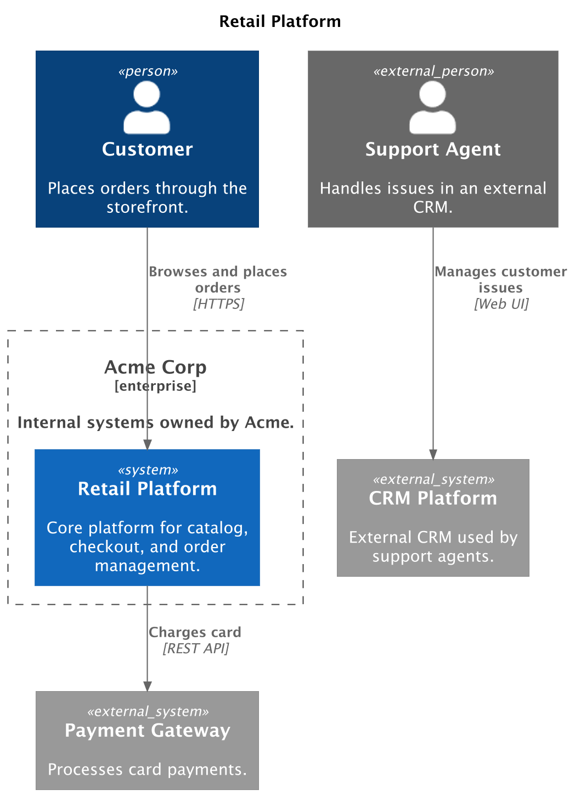

# PlantUML SystemLandscapeDiagram Spec

> **Source:** [plantuml.system-landscape-diagram.json](../../../assets/specs/plantuml.system-landscape-diagram.json)


This schema describes the [SystemLandscapeDiagram][c4.diagrams.system_context.SystemLandscapeDiagram] spec for the PlantUML backend.

## Properties

???+ info "Properties"

    <div class="code-nowrap"></div>

    | Field | Type | Description |
    |---|---|---|
    | **`type(required)`** | `string` | Type of the diagram. Must be exactly `SystemLandscapeDiagram`. |
    | `title` | <span style="white-space: nowrap;">`string` \| `null`</span> | Optional diagram title. |
    | `elements` | <code>array[<a href="#elements">Element</a>]</code> | Top-level elements. |
    | `boundaries` | <code>array[<a href="#boundaries">Boundary</a>]</code> | Top-level boundaries. |
    | `relationships` | <code>array[<a href="#plantumlrelationshipschema">PlantUMLRelationshipSchema</a>]</code> | Top-level relationships. |
    | `layouts` | <code>array[<a href="#layoutschema">LayoutSchema</a>]</code> | PlantUML relative layout constraints between elements. |
    | `render_options` | <code><a href="#plantumlrenderoptionsschema">PlantUMLRenderOptionsSchema</a></code> | PlantUML-specific render options. |
    | **`backend(required)`** | `string` | JSON schema backend. Must be exactly `plantuml`. |

??? abstract "Examples"

    === "Minimal"

        ??? example "JSON source"

            ```json
            --8<-- "assets/examples/json/plantuml/system-landscape-diagram.minimal.json"
            ```

        ??? example "Rendered PlantUML source"

            ```puml
            --8<-- "assets/examples/plantuml/system-landscape-diagram.minimal.puml"
            ```

        ??? example "Rendered image"

            <figure markdown="span">
            
            </figure>


    === "Advanced"

        ??? example "JSON source"

            ```json
            --8<-- "assets/examples/json/plantuml/system-landscape-diagram.advanced.json"
            ```

        ??? example "Rendered PlantUML source"

            ```puml
            --8<-- "assets/examples/plantuml/system-landscape-diagram.advanced.puml"
            ```

        ??? example "Rendered image"

            <figure markdown="span">
            
            </figure>


### Elements

- [PlantUMLPersonSchema](#plantumlpersonschema)
- [PlantUMLPersonExtSchema](#plantumlpersonextschema)
- [PlantUMLSystemSchema](#plantumlsystemschema)
- [PlantUMLSystemExtSchema](#plantumlsystemextschema)
- [PlantUMLSystemDbSchema](#plantumlsystemdbschema)
- [PlantUMLSystemDbExtSchema](#plantumlsystemdbextschema)
- [PlantUMLSystemQueueSchema](#plantumlsystemqueueschema)
- [PlantUMLSystemQueueExtSchema](#plantumlsystemqueueextschema)

### Boundaries

- [PlantUMLBoundarySchema](#plantumlboundaryschema)
- [PlantUMLEnterpriseBoundarySchema](#plantumlenterpriseboundaryschema)
- [PlantUMLSystemBoundarySchema](#plantumlsystemboundaryschema)

### Relationships

- [PlantUMLRelationshipSchema](#plantumlrelationshipschema)

- [PlantUMLRelationshipSchema types](#relationshiptype)

### Layouts

- [LayoutSchema](#layoutschema)

- [LayoutSchema types](#layouttype)

## Definitions


???+ warning "About **labels** and **aliases**"

    `label` is a display name for the element.

    `alias` is a unique identifier used for referencing elements
    in relationships and layouts.
    If omitted, it is generated automatically.


    You can also use `label` for referencing elements in relationships     and layouts, but each `label` must be **unique** within the diagram.


<br/>

### RelationshipType

Relationship dispatch keys used by relationship DSL classes.

`REL` is the portable core relationship type. The other values map to
backend-specific C4-PlantUML relationship macros and should normally be
used through `c4.contrib.plantuml` relationship classes.

???+ info "Items"

    <div class="code-nowrap"></div>

    | Type | Description |
    |---|---|
    | `BI_REL` | A bidirectional relationship between two elements. |
    | `BI_REL_D` | A bidirectional downward relationship. Shorthand for `BI_REL_DOWN`. |
    | `BI_REL_DOWN` | A bidirectional downward relationship. |
    | `BI_REL_L` | A bidirectional leftward relationship. Shorthand for `BI_REL_LEFT`. |
    | `BI_REL_LEFT` | A bidirectional leftward relationship. |
    | `BI_REL_NEIGHBOR` | A bidirectional neighboring relationship between two elements. |
    | `BI_REL_R` | A bidirectional rightward relationship. Shorthand for `BI_REL_RIGHT`. |
    | `BI_REL_RIGHT` | A bidirectional rightward relationship. |
    | `BI_REL_U` | A bidirectional upward relationship. Shorthand for `BI_REL_UP`. |
    | `BI_REL_UP` | A bidirectional upward relationship. |
    | `REL` | A unidirectional relationship between two elements. |
    | `REL_BACK` | A unidirectional relationship pointing backward. |
    | `REL_BACK_NEIGHBOR` | A unidirectional relationship combining backward and neighboring semantics. |
    | `REL_D` | A unidirectional downward relationship. Shorthand for `REL_DOWN`. |
    | `REL_DOWN` | A unidirectional downward relationship. |
    | `REL_L` | A unidirectional leftward relationship. Shorthand for `REL_LEFT`. |
    | `REL_LEFT` | A unidirectional leftward relationship. |
    | `REL_NEIGHBOR` | A unidirectional relationship representing a lateral or neighboring interaction. |
    | `REL_R` | A unidirectional rightward relationship. Shorthand for `REL_RIGHT`. |
    | `REL_RIGHT` | A unidirectional rightward relationship. |
    | `REL_U` | A unidirectional upward relationship. Shorthand for `REL_UP`. |
    | `REL_UP` | A unidirectional upward relationship. |

### LayoutType

Enum representing layout modifiers for diagram elements.

???+ info "Items"

    <div class="code-nowrap"></div>

    | Type | Description |
    |---|---|
    | `LAY_D` | Positions `from` element below `to` element. Shorthand for `LAY_DOWN` layout. |
    | `LAY_DOWN` | Positions `from` element below `to` element. |
    | `LAY_L` | Positions `from` element to the left of `to` element. Shorthand for `LAY_LEFT` layout. |
    | `LAY_LEFT` | Positions `from` element to the left of `to` element. |
    | `LAY_R` | Positions `from` element to the right of `to` element. Shorthand for `LAY_RIGHT` layout. |
    | `LAY_RIGHT` | Positions `from` element to the right of `to` element. |
    | `LAY_U` | Positions `from` element above `to` element. Shorthand for `LAY_UP` layout. |
    | `LAY_UP` | Positions `from` element above `to` element. |

### DiagramElementPropertiesSchema

JSON schema for tabular diagram element properties.

???+ info "Properties"

    <div class="code-nowrap"></div>

    | Field | Type | Description |
    |---|---|---|
    | `header` | <code>array[string]</code> | Header columns. Default: `["Property", "Value"]`. |
    | **`properties(required)`** | <code>array[array[string]]</code> | List of rows (each row is a list of string values). |
    | `show_header` | `boolean` | Whether to display the header row. Default: `true`. |

### LayoutSchema

JSON schema for a PlantUML relative layout constraint.

???+ info "Properties"

    <div class="code-nowrap"></div>

    | Field | Type | Description |
    |---|---|---|
    | **`type(required)`** | <code><a href="#layouttype">LayoutType</a></code> | Type of the layout. |
    | **`from(required)`** | `string` | The source element alias (or unique label). |
    | **`to(required)`** | `string` | The destination element alias (or unique label). |

### PlantUMLBoundarySchema

PlantUML JSON schema for a generic boundary.

???+ info "Properties"

    <div class="code-nowrap"></div>

    | Field | Type | Description |
    |---|---|---|
    | **`type(required)`** | `string` | Discriminator identifying the element type. Must be exactly `Boundary`. |
    | `elements` | <code>array[<a href="#elements">Element</a>]</code> | Elements nested inside this boundary. |
    | `boundaries` | <code>array[<a href="#boundaries">Boundary</a>]</code> | Boundaries nested inside this boundary. |
    | `relationships` | <code>array[<a href="#plantumlrelationshipschema">PlantUMLRelationshipSchema</a>]</code> | Relationships declared inside this boundary. |
    | `alias` | <span style="white-space: nowrap;">`string` \| `null`</span> | Unique identifier for the element. If not provided, it is autogenerated from the label. |
    | `description` | <span style="white-space: nowrap;">`string` \| `null`</span> | Optional description text. |
    | **`label(required)`** | `string` | Display name for the element. |
    | `link` | <span style="white-space: nowrap;">`string` \| `null`</span> | Optional PlantUML URL associated with the boundary. |
    | `properties` | <code><a href="#diagramelementpropertiesschema">DiagramElementPropertiesSchema</a></code> | Optional property table metadata. |
    | `stereotype` | <span style="white-space: nowrap;">`string` \| `null`</span> | Optional PlantUML custom type/stereotype label. |
    | `tags` | <code>array[string]</code> | Optional PlantUML tags for styling or grouping. |

### PlantUMLEnterpriseBoundarySchema

PlantUML JSON schema for an enterprise boundary.

???+ info "Properties"

    <div class="code-nowrap"></div>

    | Field | Type | Description |
    |---|---|---|
    | **`type(required)`** | `string` | Discriminator identifying the element type. Must be exactly `EnterpriseBoundary`. |
    | `elements` | <code>array[<a href="#elements">Element</a>]</code> | Elements nested inside this boundary. |
    | `boundaries` | <code>array[<a href="#boundaries">Boundary</a>]</code> | Boundaries nested inside this boundary. |
    | `relationships` | <code>array[<a href="#plantumlrelationshipschema">PlantUMLRelationshipSchema</a>]</code> | Relationships declared inside this boundary. |
    | `alias` | <span style="white-space: nowrap;">`string` \| `null`</span> | Unique identifier for the element. If not provided, it is autogenerated from the label. |
    | `description` | <span style="white-space: nowrap;">`string` \| `null`</span> | Optional description text. |
    | **`label(required)`** | `string` | Display name for the element. |
    | `link` | <span style="white-space: nowrap;">`string` \| `null`</span> | Optional PlantUML URL associated with the boundary. |
    | `properties` | <code><a href="#diagramelementpropertiesschema">DiagramElementPropertiesSchema</a></code> | Optional property table metadata. |
    | `stereotype` | <span style="white-space: nowrap;">`string` \| `null`</span> | Optional PlantUML custom type/stereotype label. |
    | `tags` | <code>array[string]</code> | Optional PlantUML tags for styling or grouping. |

### PlantUMLPersonExtSchema

PlantUML JSON schema for an external person.

???+ info "Properties"

    <div class="code-nowrap"></div>

    | Field | Type | Description |
    |---|---|---|
    | **`type(required)`** | `string` | Discriminator identifying the element type. Must be exactly `PersonExt`. |
    | `alias` | <span style="white-space: nowrap;">`string` \| `null`</span> | Unique identifier for the element. If not provided, it is autogenerated from the label. |
    | `base_shape` | <span style="white-space: nowrap;">`string` \| `null`</span> | Optional PlantUML base shape override. |
    | `description` | <span style="white-space: nowrap;">`string` \| `null`</span> | Optional description text. |
    | **`label(required)`** | `string` | Display name for the element. |
    | `link` | <span style="white-space: nowrap;">`string` \| `null`</span> | Optional PlantUML URL associated with the element. |
    | `properties` | <code><a href="#diagramelementpropertiesschema">DiagramElementPropertiesSchema</a></code> | Optional property table metadata. |
    | `sprite` | <span style="white-space: nowrap;">`string` \| `null`</span> | Optional PlantUML sprite/icon reference. |
    | `stereotype` | <span style="white-space: nowrap;">`string` \| `null`</span> | Optional PlantUML custom type/stereotype label. |
    | `tags` | <code>array[string]</code> | Optional PlantUML tags for styling or grouping. |
    | `technology` | <span style="white-space: nowrap;">`string` \| `null`</span> | Optional technology label where supported by the element. |

### PlantUMLPersonSchema

PlantUML JSON schema for a person.

???+ info "Properties"

    <div class="code-nowrap"></div>

    | Field | Type | Description |
    |---|---|---|
    | **`type(required)`** | `string` | Discriminator identifying the element type. Must be exactly `Person`. |
    | `alias` | <span style="white-space: nowrap;">`string` \| `null`</span> | Unique identifier for the element. If not provided, it is autogenerated from the label. |
    | `base_shape` | <span style="white-space: nowrap;">`string` \| `null`</span> | Optional PlantUML base shape override. |
    | `description` | <span style="white-space: nowrap;">`string` \| `null`</span> | Optional description text. |
    | **`label(required)`** | `string` | Display name for the element. |
    | `link` | <span style="white-space: nowrap;">`string` \| `null`</span> | Optional PlantUML URL associated with the element. |
    | `properties` | <code><a href="#diagramelementpropertiesschema">DiagramElementPropertiesSchema</a></code> | Optional property table metadata. |
    | `sprite` | <span style="white-space: nowrap;">`string` \| `null`</span> | Optional PlantUML sprite/icon reference. |
    | `stereotype` | <span style="white-space: nowrap;">`string` \| `null`</span> | Optional PlantUML custom type/stereotype label. |
    | `tags` | <code>array[string]</code> | Optional PlantUML tags for styling or grouping. |
    | `technology` | <span style="white-space: nowrap;">`string` \| `null`</span> | Optional technology label where supported by the element. |

### PlantUMLRelationshipSchema

JSON schema for relationships supported by PlantUML C4 diagrams.

???+ info "Properties"

    <div class="code-nowrap"></div>

    | Field | Type | Description |
    |---|---|---|
    | **`type(required)`** | <code><a href="#relationshiptype">RelationshipType</a></code> | Type of the relationship. |
    | `description` | <span style="white-space: nowrap;">`string` \| `null`</span> | Additional details about the relationship. |
    | **`from(required)`** | `string` | The source element alias (or unique label). |
    | `index` | <span style="white-space: nowrap;">`string` \| `null`</span> | Optional PlantUML dynamic relationship index. |
    | **`label(required)`** | `string` | The label shown on the relationship edge. |
    | `link` | <span style="white-space: nowrap;">`string` \| `null`</span> | Optional PlantUML URL associated with the relationship. |
    | `properties` | <code><a href="#diagramelementpropertiesschema">DiagramElementPropertiesSchema</a></code> | Optional property table metadata. |
    | `sprite` | <span style="white-space: nowrap;">`string` \| `null`</span> | Optional PlantUML sprite/icon for the relationship. |
    | `tags` | <code>array[string]</code> | Optional PlantUML relationship tags. |
    | `technology` | <span style="white-space: nowrap;">`string` \| `null`</span> | The technology used in the communication. |
    | **`to(required)`** | `string` | The destination element alias (or unique label). |

### PlantUMLSystemBoundarySchema

PlantUML JSON schema for a system boundary.

???+ info "Properties"

    <div class="code-nowrap"></div>

    | Field | Type | Description |
    |---|---|---|
    | **`type(required)`** | `string` | Discriminator identifying the element type. Must be exactly `SystemBoundary`. |
    | `elements` | <code>array[<a href="#elements">Element</a>]</code> | Elements nested inside this boundary. |
    | `boundaries` | <code>array[<a href="#boundaries">Boundary</a>]</code> | Boundaries nested inside this boundary. |
    | `relationships` | <code>array[<a href="#plantumlrelationshipschema">PlantUMLRelationshipSchema</a>]</code> | Relationships declared inside this boundary. |
    | `alias` | <span style="white-space: nowrap;">`string` \| `null`</span> | Unique identifier for the element. If not provided, it is autogenerated from the label. |
    | `description` | <span style="white-space: nowrap;">`string` \| `null`</span> | Optional description text. |
    | **`label(required)`** | `string` | Display name for the element. |
    | `link` | <span style="white-space: nowrap;">`string` \| `null`</span> | Optional PlantUML URL associated with the boundary. |
    | `properties` | <code><a href="#diagramelementpropertiesschema">DiagramElementPropertiesSchema</a></code> | Optional property table metadata. |
    | `stereotype` | <span style="white-space: nowrap;">`string` \| `null`</span> | Optional PlantUML custom type/stereotype label. |
    | `tags` | <code>array[string]</code> | Optional PlantUML tags for styling or grouping. |

### PlantUMLSystemDbExtSchema

PlantUML JSON schema for an external database-like system.

???+ info "Properties"

    <div class="code-nowrap"></div>

    | Field | Type | Description |
    |---|---|---|
    | **`type(required)`** | `string` | Discriminator identifying the element type. Must be exactly `SystemDbExt`. |
    | `alias` | <span style="white-space: nowrap;">`string` \| `null`</span> | Unique identifier for the element. If not provided, it is autogenerated from the label. |
    | `base_shape` | <span style="white-space: nowrap;">`string` \| `null`</span> | Optional PlantUML base shape override. |
    | `description` | <span style="white-space: nowrap;">`string` \| `null`</span> | Optional description text. |
    | **`label(required)`** | `string` | Display name for the element. |
    | `link` | <span style="white-space: nowrap;">`string` \| `null`</span> | Optional PlantUML URL associated with the element. |
    | `properties` | <code><a href="#diagramelementpropertiesschema">DiagramElementPropertiesSchema</a></code> | Optional property table metadata. |
    | `sprite` | <span style="white-space: nowrap;">`string` \| `null`</span> | Optional PlantUML sprite/icon reference. |
    | `stereotype` | <span style="white-space: nowrap;">`string` \| `null`</span> | Optional PlantUML custom type/stereotype label. |
    | `tags` | <code>array[string]</code> | Optional PlantUML tags for styling or grouping. |
    | `technology` | <span style="white-space: nowrap;">`string` \| `null`</span> | Optional technology label where supported by the element. |

### PlantUMLSystemDbSchema

PlantUML JSON schema for a database-like system.

???+ info "Properties"

    <div class="code-nowrap"></div>

    | Field | Type | Description |
    |---|---|---|
    | **`type(required)`** | `string` | Discriminator identifying the element type. Must be exactly `SystemDb`. |
    | `alias` | <span style="white-space: nowrap;">`string` \| `null`</span> | Unique identifier for the element. If not provided, it is autogenerated from the label. |
    | `base_shape` | <span style="white-space: nowrap;">`string` \| `null`</span> | Optional PlantUML base shape override. |
    | `description` | <span style="white-space: nowrap;">`string` \| `null`</span> | Optional description text. |
    | **`label(required)`** | `string` | Display name for the element. |
    | `link` | <span style="white-space: nowrap;">`string` \| `null`</span> | Optional PlantUML URL associated with the element. |
    | `properties` | <code><a href="#diagramelementpropertiesschema">DiagramElementPropertiesSchema</a></code> | Optional property table metadata. |
    | `sprite` | <span style="white-space: nowrap;">`string` \| `null`</span> | Optional PlantUML sprite/icon reference. |
    | `stereotype` | <span style="white-space: nowrap;">`string` \| `null`</span> | Optional PlantUML custom type/stereotype label. |
    | `tags` | <code>array[string]</code> | Optional PlantUML tags for styling or grouping. |
    | `technology` | <span style="white-space: nowrap;">`string` \| `null`</span> | Optional technology label where supported by the element. |

### PlantUMLSystemExtSchema

PlantUML JSON schema for an external software system.

???+ info "Properties"

    <div class="code-nowrap"></div>

    | Field | Type | Description |
    |---|---|---|
    | **`type(required)`** | `string` | Discriminator identifying the element type. Must be exactly `SystemExt`. |
    | `alias` | <span style="white-space: nowrap;">`string` \| `null`</span> | Unique identifier for the element. If not provided, it is autogenerated from the label. |
    | `base_shape` | <span style="white-space: nowrap;">`string` \| `null`</span> | Optional PlantUML base shape override. |
    | `description` | <span style="white-space: nowrap;">`string` \| `null`</span> | Optional description text. |
    | **`label(required)`** | `string` | Display name for the element. |
    | `link` | <span style="white-space: nowrap;">`string` \| `null`</span> | Optional PlantUML URL associated with the element. |
    | `properties` | <code><a href="#diagramelementpropertiesschema">DiagramElementPropertiesSchema</a></code> | Optional property table metadata. |
    | `sprite` | <span style="white-space: nowrap;">`string` \| `null`</span> | Optional PlantUML sprite/icon reference. |
    | `stereotype` | <span style="white-space: nowrap;">`string` \| `null`</span> | Optional PlantUML custom type/stereotype label. |
    | `tags` | <code>array[string]</code> | Optional PlantUML tags for styling or grouping. |
    | `technology` | <span style="white-space: nowrap;">`string` \| `null`</span> | Optional technology label where supported by the element. |

### PlantUMLSystemQueueExtSchema

PlantUML JSON schema for an external queue-like system.

???+ info "Properties"

    <div class="code-nowrap"></div>

    | Field | Type | Description |
    |---|---|---|
    | **`type(required)`** | `string` | Discriminator identifying the element type. Must be exactly `SystemQueueExt`. |
    | `alias` | <span style="white-space: nowrap;">`string` \| `null`</span> | Unique identifier for the element. If not provided, it is autogenerated from the label. |
    | `base_shape` | <span style="white-space: nowrap;">`string` \| `null`</span> | Optional PlantUML base shape override. |
    | `description` | <span style="white-space: nowrap;">`string` \| `null`</span> | Optional description text. |
    | **`label(required)`** | `string` | Display name for the element. |
    | `link` | <span style="white-space: nowrap;">`string` \| `null`</span> | Optional PlantUML URL associated with the element. |
    | `properties` | <code><a href="#diagramelementpropertiesschema">DiagramElementPropertiesSchema</a></code> | Optional property table metadata. |
    | `sprite` | <span style="white-space: nowrap;">`string` \| `null`</span> | Optional PlantUML sprite/icon reference. |
    | `stereotype` | <span style="white-space: nowrap;">`string` \| `null`</span> | Optional PlantUML custom type/stereotype label. |
    | `tags` | <code>array[string]</code> | Optional PlantUML tags for styling or grouping. |
    | `technology` | <span style="white-space: nowrap;">`string` \| `null`</span> | Optional technology label where supported by the element. |

### PlantUMLSystemQueueSchema

PlantUML JSON schema for a queue-like system.

???+ info "Properties"

    <div class="code-nowrap"></div>

    | Field | Type | Description |
    |---|---|---|
    | **`type(required)`** | `string` | Discriminator identifying the element type. Must be exactly `SystemQueue`. |
    | `alias` | <span style="white-space: nowrap;">`string` \| `null`</span> | Unique identifier for the element. If not provided, it is autogenerated from the label. |
    | `base_shape` | <span style="white-space: nowrap;">`string` \| `null`</span> | Optional PlantUML base shape override. |
    | `description` | <span style="white-space: nowrap;">`string` \| `null`</span> | Optional description text. |
    | **`label(required)`** | `string` | Display name for the element. |
    | `link` | <span style="white-space: nowrap;">`string` \| `null`</span> | Optional PlantUML URL associated with the element. |
    | `properties` | <code><a href="#diagramelementpropertiesschema">DiagramElementPropertiesSchema</a></code> | Optional property table metadata. |
    | `sprite` | <span style="white-space: nowrap;">`string` \| `null`</span> | Optional PlantUML sprite/icon reference. |
    | `stereotype` | <span style="white-space: nowrap;">`string` \| `null`</span> | Optional PlantUML custom type/stereotype label. |
    | `tags` | <code>array[string]</code> | Optional PlantUML tags for styling or grouping. |
    | `technology` | <span style="white-space: nowrap;">`string` \| `null`</span> | Optional technology label where supported by the element. |

### PlantUMLSystemSchema

PlantUML JSON schema for a software system.

???+ info "Properties"

    <div class="code-nowrap"></div>

    | Field | Type | Description |
    |---|---|---|
    | **`type(required)`** | `string` | Discriminator identifying the element type. Must be exactly `System`. |
    | `alias` | <span style="white-space: nowrap;">`string` \| `null`</span> | Unique identifier for the element. If not provided, it is autogenerated from the label. |
    | `base_shape` | <span style="white-space: nowrap;">`string` \| `null`</span> | Optional PlantUML base shape override. |
    | `description` | <span style="white-space: nowrap;">`string` \| `null`</span> | Optional description text. |
    | **`label(required)`** | `string` | Display name for the element. |
    | `link` | <span style="white-space: nowrap;">`string` \| `null`</span> | Optional PlantUML URL associated with the element. |
    | `properties` | <code><a href="#diagramelementpropertiesschema">DiagramElementPropertiesSchema</a></code> | Optional property table metadata. |
    | `sprite` | <span style="white-space: nowrap;">`string` \| `null`</span> | Optional PlantUML sprite/icon reference. |
    | `stereotype` | <span style="white-space: nowrap;">`string` \| `null`</span> | Optional PlantUML custom type/stereotype label. |
    | `tags` | <code>array[string]</code> | Optional PlantUML tags for styling or grouping. |
    | `technology` | <span style="white-space: nowrap;">`string` \| `null`</span> | Optional technology label where supported by the element. |


## PlantUML Render Options


### PlantUMLRenderOptionsSchema

Final layout configuration for rendering a C4-PlantUML diagram.

Encapsulates layout directives, macros, tag definitions, and visual styles
applied at render time.

???+ info "Properties"

    <div class="code-nowrap"></div>

    | Field | Type | Description |
    |---|---|---|
    | `hide_person_sprite` | `boolean` | Whether to hide person sprites globally. Default: `false`. |
    | `hide_stereotype` | `boolean` | Whether to hide stereotype labels globally. Default: `false`. |
    | `includes` | <code>array[string]</code> | A list of PlantUML `!include` directives to be injected at the beginning of the diagram. |
    | `layout` | <code><a href="#diagramlayout">DiagramLayout</a></code> | Layout direction. |
    | `layout_as_sketch` | `boolean` | Whether to apply the LAYOUT_AS_SKETCH macro. Default: `false`. |
    | `layout_with_legend` | `boolean` | Whether to apply the LAYOUT_WITH_LEGEND macro. Default: `false`. |
    | `legend_title` | <span style="white-space: nowrap;">`string` \| `null`</span> | Optional title displayed above the legend. |
    | `set_sketch_style` | <code><a href="#setsketchstyleschema">SetSketchStyleSchema</a></code> | Optional sketch-style visual customization. |
    | `show_floating_legend` | <code><a href="#showfloatinglegendschema">ShowFloatingLegendSchema</a></code> | Configuration for the SHOW_FLOATING_LEGEND macro. |
    | `show_legend` | <code><a href="#showlegendschema">ShowLegendSchema</a></code> | Configuration for the SHOW_LEGEND macro. |
    | `show_person_outline` | `boolean` | Whether to enable person outlines. Default: `false`. |
    | `show_person_portrait` | `boolean` | Whether to enable person portraits. Default: `false`. |
    | `show_person_sprite` | <code><a href="#showpersonspriteschema">ShowPersonSpriteSchema</a></code> | Configuration for the SHOW_PERSON_SPRITE macro. |
    | `styles` | <code>array[<br/>&nbsp;<code><a href="#elementstyleschema">ElementStyleSchema</a></code><br/>&nbsp;\|<code><a href="#boundarystyleschema">BoundaryStyleSchema</a></code><br/>&nbsp;\|<code><a href="#containerboundarystyleschema">ContainerBoundaryStyleSchema</a></code><br/>&nbsp;\|<code><a href="#systemboundarystyleschema">SystemBoundaryStyleSchema</a></code><br/>&nbsp;\|<code><a href="#enterpriseboundarystyleschema">EnterpriseBoundaryStyleSchema</a></code><br/>&nbsp;\|<code><a href="#relstyleschema">RelStyleSchema</a></code><br/>]</code> | List of style update macro configurations. |
    | `tags` | <code>array[<br/>&nbsp;<code><a href="#elementtagschema">ElementTagSchema</a></code><br/>&nbsp;\|<code><a href="#boundarytagschema">BoundaryTagSchema</a></code><br/>&nbsp;\|<code><a href="#componenttagschema">ComponentTagSchema</a></code><br/>&nbsp;\|<code><a href="#externalcomponenttagschema">ExternalComponentTagSchema</a></code><br/>&nbsp;\|<code><a href="#containertagschema">ContainerTagSchema</a></code><br/>&nbsp;\|<code><a href="#externalcontainertagschema">ExternalContainerTagSchema</a></code><br/>&nbsp;\|<code><a href="#nodetagschema">NodeTagSchema</a></code><br/>&nbsp;\|<code><a href="#reltagschema">RelTagSchema</a></code><br/>&nbsp;\|<code><a href="#persontagschema">PersonTagSchema</a></code><br/>&nbsp;\|<code><a href="#externalpersontagschema">ExternalPersonTagSchema</a></code><br/>&nbsp;\|<code><a href="#systemtagschema">SystemTagSchema</a></code><br/>&nbsp;\|<code><a href="#externalsystemtagschema">ExternalSystemTagSchema</a></code><br/>]</code> | List of tag macro configurations. |
    | `without_property_header` | `boolean` | If true, omit the header row and render the second column in bold. Default: `false`. |

### DiagramLayout

Defines layout direction options for a PlantUML diagram.

This enum controls how diagram elements are arranged visually using
predefined PlantUML layout macros.

- `LAYOUT_LANDSCAPE`
- `LAYOUT_LEFT_RIGHT`
- `LAYOUT_TOP_DOWN`

### BoundaryStyleSchema

Style update for a boundary element (container/system/enterprise boundary).

???+ info "Properties"

    <div class="code-nowrap"></div>

    | Field | Type | Description |
    |---|---|---|
    | **`type(required)`** | `string` | Discriminator identifying the element type. Must be exactly `BoundaryStyle`. |
    | `bg_color` | <span style="white-space: nowrap;">`string` \| `null`</span> | Background color. |
    | `border_color` | <span style="white-space: nowrap;">`string` \| `null`</span> | Border line color. |
    | `border_style` | <code><a href="#linestyle">LineStyle</a></code> | Border line style macro. |
    | `border_thickness` | <span style="white-space: nowrap;">`string` \| `null`</span> | Thickness of the border line. |
    | `element_name` | <span style="white-space: nowrap;">`string` \| `null`</span> | Boundary element type to style (e.g. 'enterprise', 'system', 'container'). |
    | `font_color` | <span style="white-space: nowrap;">`string` \| `null`</span> | Font/text color. |
    | `legend_sprite` | <span style="white-space: nowrap;">`string` \| `null`</span> | Legend sprite for this styled boundary. |
    | `legend_text` | <span style="white-space: nowrap;">`string` \| `null`</span> | Legend label for this styled boundary. |
    | `shadowing` | <span style="white-space: nowrap;">`boolean` \| `null`</span> | Shadow style/toggle. |
    | `shape` | <code><a href="#tagshape">TagShape</a></code> | Shape macro used for rendering. |
    | `sprite` | <span style="white-space: nowrap;">`string` \| `null`</span> | Sprite icon applied to the boundary. |
    | `stereotype` | <span style="white-space: nowrap;">`string` \| `null`</span> | Optional custom type/stereotype label. |

### BoundaryTagSchema

Tag for diagram boundaries (containers/systems).

???+ info "Properties"

    <div class="code-nowrap"></div>

    | Field | Type | Description |
    |---|---|---|
    | **`type(required)`** | `string` | Discriminator identifying the element type. Must be exactly `BoundaryTag`. |
    | `bg_color` | <span style="white-space: nowrap;">`string` \| `null`</span> | Background color of the boundary. |
    | `border_color` | <span style="white-space: nowrap;">`string` \| `null`</span> | Color of the boundary border. |
    | `border_style` | <code><a href="#linestyle">LineStyle</a></code> | Boundary border line style macro. |
    | `border_thickness` | <span style="white-space: nowrap;">`string` \| `null`</span> | Thickness of the boundary border line. |
    | `font_color` | <span style="white-space: nowrap;">`string` \| `null`</span> | Font color used for boundary labels. |
    | `legend_sprite` | <span style="white-space: nowrap;">`string` \| `null`</span> | Sprite displayed in the legend for this tag. |
    | `legend_text` | <span style="white-space: nowrap;">`string` \| `null`</span> | Text shown in the diagram legend for this tag. |
    | `shadowing` | <span style="white-space: nowrap;">`boolean` \| `null`</span> | Shadow style/toggle. Default: `false`. |
    | `shape` | <code><a href="#tagshape">TagShape</a></code> | Optional shape macro used for rendering. |
    | `sprite` | <span style="white-space: nowrap;">`string` \| `null`</span> | Sprite icon associated with the element or relationship. |
    | `stereotype` | <span style="white-space: nowrap;">`string` \| `null`</span> | Optional custom type/stereotype label. |
    | **`tag_stereo(required)`** | `string` | Stereotype name of the tag. Must match one of the tags declared in the `tags` field of a diagram component. |

### ComponentTagSchema

Tag for internal software components.

???+ info "Properties"

    <div class="code-nowrap"></div>

    | Field | Type | Description |
    |---|---|---|
    | **`type(required)`** | `string` | Discriminator identifying the element type. Must be exactly `ComponentTag`. |
    | `bg_color` | <span style="white-space: nowrap;">`string` \| `null`</span> | Background color of the element. |
    | `border_color` | <span style="white-space: nowrap;">`string` \| `null`</span> | Color of the element border. |
    | `border_style` | <code><a href="#linestyle">LineStyle</a></code> | Border line style macro. |
    | `border_thickness` | <span style="white-space: nowrap;">`string` \| `null`</span> | Thickness of the element border line. |
    | `font_color` | <span style="white-space: nowrap;">`string` \| `null`</span> | Font color used for labels. |
    | `legend_sprite` | <span style="white-space: nowrap;">`string` \| `null`</span> | Sprite displayed in the legend for this tag. |
    | `legend_text` | <span style="white-space: nowrap;">`string` \| `null`</span> | Text shown in the diagram legend for this tag. |
    | `shadowing` | <span style="white-space: nowrap;">`boolean` \| `null`</span> | Shadow style/toggle. Default: `false`. |
    | `shape` | <code><a href="#tagshape">TagShape</a></code> | Optional shape macro used for rendering. |
    | `sprite` | <span style="white-space: nowrap;">`string` \| `null`</span> | Sprite icon associated with the element or relationship. |
    | **`tag_stereo(required)`** | `string` | Stereotype name of the tag. Must match one of the tags declared in the `tags` field of a diagram component. |
    | `technology` | <span style="white-space: nowrap;">`string` \| `null`</span> | Technology label shown on the element. |

### ContainerBoundaryStyleSchema

Style update for container boundaries.

???+ info "Properties"

    <div class="code-nowrap"></div>

    | Field | Type | Description |
    |---|---|---|
    | **`type(required)`** | `string` | Discriminator identifying the element type. Must be exactly `ContainerBoundaryStyle`. |
    | `bg_color` | <span style="white-space: nowrap;">`string` \| `null`</span> | Background color. |
    | `border_color` | <span style="white-space: nowrap;">`string` \| `null`</span> | Border line color. |
    | `border_style` | <code><a href="#linestyle">LineStyle</a></code> | Border line style macro. |
    | `border_thickness` | <span style="white-space: nowrap;">`string` \| `null`</span> | Thickness of the border line. |
    | `font_color` | <span style="white-space: nowrap;">`string` \| `null`</span> | Font/text color. |
    | `legend_sprite` | <span style="white-space: nowrap;">`string` \| `null`</span> | Legend sprite for this styled boundary. |
    | `legend_text` | <span style="white-space: nowrap;">`string` \| `null`</span> | Legend label for this styled boundary. |
    | `shadowing` | <span style="white-space: nowrap;">`boolean` \| `null`</span> | Shadow style/toggle. |
    | `shape` | <code><a href="#tagshape">TagShape</a></code> | Shape macro used for rendering. |
    | `sprite` | <span style="white-space: nowrap;">`string` \| `null`</span> | Sprite icon applied to the boundary. |
    | `stereotype` | <span style="white-space: nowrap;">`string` \| `null`</span> | Optional custom type/stereotype label. |

### ContainerTagSchema

Tag for internal containers (microservices, databases, etc.).

???+ info "Properties"

    <div class="code-nowrap"></div>

    | Field | Type | Description |
    |---|---|---|
    | **`type(required)`** | `string` | Discriminator identifying the element type. Must be exactly `ContainerTag`. |
    | `bg_color` | <span style="white-space: nowrap;">`string` \| `null`</span> | Background color of the element. |
    | `border_color` | <span style="white-space: nowrap;">`string` \| `null`</span> | Color of the element border. |
    | `border_style` | <code><a href="#linestyle">LineStyle</a></code> | Border line style macro. |
    | `border_thickness` | <span style="white-space: nowrap;">`string` \| `null`</span> | Thickness of the element border line. |
    | `font_color` | <span style="white-space: nowrap;">`string` \| `null`</span> | Font color used for labels. |
    | `legend_sprite` | <span style="white-space: nowrap;">`string` \| `null`</span> | Sprite displayed in the legend for this tag. |
    | `legend_text` | <span style="white-space: nowrap;">`string` \| `null`</span> | Text shown in the diagram legend for this tag. |
    | `shadowing` | <span style="white-space: nowrap;">`boolean` \| `null`</span> | Shadow style/toggle. Default: `false`. |
    | `shape` | <code><a href="#tagshape">TagShape</a></code> | Optional shape macro used for rendering. |
    | `sprite` | <span style="white-space: nowrap;">`string` \| `null`</span> | Sprite icon associated with the element or relationship. |
    | **`tag_stereo(required)`** | `string` | Stereotype name of the tag. Must match one of the tags declared in the `tags` field of a diagram component. |
    | `technology` | <span style="white-space: nowrap;">`string` \| `null`</span> | Technology label shown on the element. |

### Details

Defines PlantUML legend details.

- `None`
- `Normal`
- `Small`

### ElementStyleSchema

Style update for an individual diagram element.

???+ info "Properties"

    <div class="code-nowrap"></div>

    | Field | Type | Description |
    |---|---|---|
    | **`type(required)`** | `string` | Discriminator identifying the element type. Must be exactly `ElementStyle`. |
    | `bg_color` | <span style="white-space: nowrap;">`string` \| `null`</span> | Background color. |
    | `border_color` | <span style="white-space: nowrap;">`string` \| `null`</span> | Border line color. |
    | `border_style` | <code><a href="#linestyle">LineStyle</a></code> | Border line style macro. |
    | `border_thickness` | <span style="white-space: nowrap;">`string` \| `null`</span> | Thickness of the border line. |
    | **`element_name(required)`** | `string` | C4 element type to style (e.g. 'person', 'system', 'container'). This applies to all elements of the given type, not a specific instance. |
    | `font_color` | <span style="white-space: nowrap;">`string` \| `null`</span> | Font/text color. |
    | `legend_sprite` | <span style="white-space: nowrap;">`string` \| `null`</span> | Legend sprite for this styled element. |
    | `legend_text` | <span style="white-space: nowrap;">`string` \| `null`</span> | Legend label for this styled element. |
    | `shadowing` | <span style="white-space: nowrap;">`boolean` \| `null`</span> | Shadow style/toggle. |
    | `shape` | <code><a href="#tagshape">TagShape</a></code> | Shape macro used for rendering. |
    | `sprite` | <span style="white-space: nowrap;">`string` \| `null`</span> | Sprite icon applied to the element. |
    | `technology` | <span style="white-space: nowrap;">`string` \| `null`</span> | Technology label shown on the element. |

### ElementTagSchema

Represents a tag for general diagram elements
(containers, nodes, components).

Defines color, border, shape, and optional technology metadata.

???+ info "Properties"

    <div class="code-nowrap"></div>

    | Field | Type | Description |
    |---|---|---|
    | **`type(required)`** | `string` | Discriminator identifying the element type. Must be exactly `ElementTag`. |
    | `bg_color` | <span style="white-space: nowrap;">`string` \| `null`</span> | Background color of the element. |
    | `border_color` | <span style="white-space: nowrap;">`string` \| `null`</span> | Color of the element border. |
    | `border_style` | <code><a href="#linestyle">LineStyle</a></code> | Border line style macro. |
    | `border_thickness` | <span style="white-space: nowrap;">`string` \| `null`</span> | Thickness of the element border line. |
    | `font_color` | <span style="white-space: nowrap;">`string` \| `null`</span> | Font color used for labels. |
    | `legend_sprite` | <span style="white-space: nowrap;">`string` \| `null`</span> | Sprite displayed in the legend for this tag. |
    | `legend_text` | <span style="white-space: nowrap;">`string` \| `null`</span> | Text shown in the diagram legend for this tag. |
    | `shadowing` | <span style="white-space: nowrap;">`boolean` \| `null`</span> | Shadow style/toggle. Default: `false`. |
    | `shape` | <code><a href="#tagshape">TagShape</a></code> | Optional shape macro used for rendering. |
    | `sprite` | <span style="white-space: nowrap;">`string` \| `null`</span> | Sprite icon associated with the element or relationship. |
    | **`tag_stereo(required)`** | `string` | Stereotype name of the tag. Must match one of the tags declared in the `tags` field of a diagram component. |
    | `technology` | <span style="white-space: nowrap;">`string` \| `null`</span> | Technology label shown on the element. |

### EnterpriseBoundaryStyleSchema

Style update for enterprise boundaries.

???+ info "Properties"

    <div class="code-nowrap"></div>

    | Field | Type | Description |
    |---|---|---|
    | **`type(required)`** | `string` | Discriminator identifying the element type. Must be exactly `EnterpriseBoundaryStyle`. |
    | `bg_color` | <span style="white-space: nowrap;">`string` \| `null`</span> | Background color. |
    | `border_color` | <span style="white-space: nowrap;">`string` \| `null`</span> | Border line color. |
    | `border_style` | <code><a href="#linestyle">LineStyle</a></code> | Border line style macro. |
    | `border_thickness` | <span style="white-space: nowrap;">`string` \| `null`</span> | Thickness of the border line. |
    | `font_color` | <span style="white-space: nowrap;">`string` \| `null`</span> | Font/text color. |
    | `legend_sprite` | <span style="white-space: nowrap;">`string` \| `null`</span> | Legend sprite for this styled boundary. |
    | `legend_text` | <span style="white-space: nowrap;">`string` \| `null`</span> | Legend label for this styled boundary. |
    | `shadowing` | <span style="white-space: nowrap;">`boolean` \| `null`</span> | Shadow style/toggle. |
    | `shape` | <code><a href="#tagshape">TagShape</a></code> | Shape macro used for rendering. |
    | `sprite` | <span style="white-space: nowrap;">`string` \| `null`</span> | Sprite icon applied to the boundary. |
    | `stereotype` | <span style="white-space: nowrap;">`string` \| `null`</span> | Optional custom type/stereotype label. |

### ExternalComponentTagSchema

Tag for external software components.

???+ info "Properties"

    <div class="code-nowrap"></div>

    | Field | Type | Description |
    |---|---|---|
    | **`type(required)`** | `string` | Discriminator identifying the element type. Must be exactly `ExternalComponentTag`. |
    | `bg_color` | <span style="white-space: nowrap;">`string` \| `null`</span> | Background color of the element. |
    | `border_color` | <span style="white-space: nowrap;">`string` \| `null`</span> | Color of the element border. |
    | `border_style` | <code><a href="#linestyle">LineStyle</a></code> | Border line style macro. |
    | `border_thickness` | <span style="white-space: nowrap;">`string` \| `null`</span> | Thickness of the element border line. |
    | `font_color` | <span style="white-space: nowrap;">`string` \| `null`</span> | Font color used for labels. |
    | `legend_sprite` | <span style="white-space: nowrap;">`string` \| `null`</span> | Sprite displayed in the legend for this tag. |
    | `legend_text` | <span style="white-space: nowrap;">`string` \| `null`</span> | Text shown in the diagram legend for this tag. |
    | `shadowing` | <span style="white-space: nowrap;">`boolean` \| `null`</span> | Shadow style/toggle. Default: `false`. |
    | `shape` | <code><a href="#tagshape">TagShape</a></code> | Optional shape macro used for rendering. |
    | `sprite` | <span style="white-space: nowrap;">`string` \| `null`</span> | Sprite icon associated with the element or relationship. |
    | **`tag_stereo(required)`** | `string` | Stereotype name of the tag. Must match one of the tags declared in the `tags` field of a diagram component. |
    | `technology` | <span style="white-space: nowrap;">`string` \| `null`</span> | Technology label shown on the element. |

### ExternalContainerTagSchema

Tag for external containers.

???+ info "Properties"

    <div class="code-nowrap"></div>

    | Field | Type | Description |
    |---|---|---|
    | **`type(required)`** | `string` | Discriminator identifying the element type. Must be exactly `ExternalContainerTag`. |
    | `bg_color` | <span style="white-space: nowrap;">`string` \| `null`</span> | Background color of the element. |
    | `border_color` | <span style="white-space: nowrap;">`string` \| `null`</span> | Color of the element border. |
    | `border_style` | <code><a href="#linestyle">LineStyle</a></code> | Border line style macro. |
    | `border_thickness` | <span style="white-space: nowrap;">`string` \| `null`</span> | Thickness of the element border line. |
    | `font_color` | <span style="white-space: nowrap;">`string` \| `null`</span> | Font color used for labels. |
    | `legend_sprite` | <span style="white-space: nowrap;">`string` \| `null`</span> | Sprite displayed in the legend for this tag. |
    | `legend_text` | <span style="white-space: nowrap;">`string` \| `null`</span> | Text shown in the diagram legend for this tag. |
    | `shadowing` | <span style="white-space: nowrap;">`boolean` \| `null`</span> | Shadow style/toggle. Default: `false`. |
    | `shape` | <code><a href="#tagshape">TagShape</a></code> | Optional shape macro used for rendering. |
    | `sprite` | <span style="white-space: nowrap;">`string` \| `null`</span> | Sprite icon associated with the element or relationship. |
    | **`tag_stereo(required)`** | `string` | Stereotype name of the tag. Must match one of the tags declared in the `tags` field of a diagram component. |
    | `technology` | <span style="white-space: nowrap;">`string` \| `null`</span> | Technology label shown on the element. |

### ExternalPersonTagSchema

Tag for external people (outside the system boundary).

???+ info "Properties"

    <div class="code-nowrap"></div>

    | Field | Type | Description |
    |---|---|---|
    | **`type(required)`** | `string` | Discriminator identifying the element type. Must be exactly `ExternalPersonTag`. |
    | `bg_color` | <span style="white-space: nowrap;">`string` \| `null`</span> | Background color of the person symbol. |
    | `border_color` | <span style="white-space: nowrap;">`string` \| `null`</span> | Border color of the person symbol. |
    | `border_style` | <code><a href="#linestyle">LineStyle</a></code> | Border line style macro. |
    | `border_thickness` | <span style="white-space: nowrap;">`string` \| `null`</span> | Thickness of the person border line. |
    | `font_color` | <span style="white-space: nowrap;">`string` \| `null`</span> | Font color used in the label. |
    | `legend_sprite` | <span style="white-space: nowrap;">`string` \| `null`</span> | Sprite displayed in the legend for this tag. |
    | `legend_text` | <span style="white-space: nowrap;">`string` \| `null`</span> | Text shown in the diagram legend for this tag. |
    | `shadowing` | <span style="white-space: nowrap;">`boolean` \| `null`</span> | Shadow style/toggle. Default: `false`. |
    | `shape` | <code><a href="#tagshape">TagShape</a></code> | Optional shape macro used for rendering. |
    | `sprite` | <span style="white-space: nowrap;">`string` \| `null`</span> | Sprite icon associated with the element or relationship. |
    | `stereotype` | <span style="white-space: nowrap;">`string` \| `null`</span> | Optional custom type/stereotype label. |
    | **`tag_stereo(required)`** | `string` | Stereotype name of the tag. Must match one of the tags declared in the `tags` field of a diagram component. |

### ExternalSystemTagSchema

Tag for external software systems.

???+ info "Properties"

    <div class="code-nowrap"></div>

    | Field | Type | Description |
    |---|---|---|
    | **`type(required)`** | `string` | Discriminator identifying the element type. Must be exactly `ExternalSystemTag`. |
    | `bg_color` | <span style="white-space: nowrap;">`string` \| `null`</span> | Background color of the system element. |
    | `border_color` | <span style="white-space: nowrap;">`string` \| `null`</span> | Border color of the system element. |
    | `border_style` | <code><a href="#linestyle">LineStyle</a></code> | Border line style macro. |
    | `border_thickness` | <span style="white-space: nowrap;">`string` \| `null`</span> | Thickness of the system border line. |
    | `font_color` | <span style="white-space: nowrap;">`string` \| `null`</span> | Font color used in system labels. |
    | `legend_sprite` | <span style="white-space: nowrap;">`string` \| `null`</span> | Sprite displayed in the legend for this tag. |
    | `legend_text` | <span style="white-space: nowrap;">`string` \| `null`</span> | Text shown in the diagram legend for this tag. |
    | `shadowing` | <span style="white-space: nowrap;">`boolean` \| `null`</span> | Shadow style/toggle. Default: `false`. |
    | `shape` | <code><a href="#tagshape">TagShape</a></code> | Optional shape macro used for rendering. |
    | `sprite` | <span style="white-space: nowrap;">`string` \| `null`</span> | Sprite icon associated with the element or relationship. |
    | `stereotype` | <span style="white-space: nowrap;">`string` \| `null`</span> | Optional custom type/stereotype label. |
    | **`tag_stereo(required)`** | `string` | Stereotype name of the tag. Must match one of the tags declared in the `tags` field of a diagram component. |

### LineStyle

Defines PlantUML line style.

- `BoldLine`
- `DashedLine`
- `DottedLine`
- `SolidLine`

### NodeTagSchema

Tag for nodes (typically infrastructure elements).

???+ info "Properties"

    <div class="code-nowrap"></div>

    | Field | Type | Description |
    |---|---|---|
    | **`type(required)`** | `string` | Discriminator identifying the element type. Must be exactly `NodeTag`. |
    | `bg_color` | <span style="white-space: nowrap;">`string` \| `null`</span> | Background color of the node. |
    | `border_color` | <span style="white-space: nowrap;">`string` \| `null`</span> | Color of the node border. |
    | `border_style` | <code><a href="#linestyle">LineStyle</a></code> | Node border line style macro. |
    | `border_thickness` | <span style="white-space: nowrap;">`string` \| `null`</span> | Thickness of the node border line. |
    | `font_color` | <span style="white-space: nowrap;">`string` \| `null`</span> | Font color used for node labels. |
    | `legend_sprite` | <span style="white-space: nowrap;">`string` \| `null`</span> | Sprite displayed in the legend for this tag. |
    | `legend_text` | <span style="white-space: nowrap;">`string` \| `null`</span> | Text shown in the diagram legend for this tag. |
    | `shadowing` | <span style="white-space: nowrap;">`boolean` \| `null`</span> | Shadow style/toggle. Default: `false`. |
    | `shape` | <code><a href="#tagshape">TagShape</a></code> | Optional shape macro used for rendering. |
    | `sprite` | <span style="white-space: nowrap;">`string` \| `null`</span> | Sprite icon associated with the element or relationship. |
    | `stereotype` | <span style="white-space: nowrap;">`string` \| `null`</span> | Optional custom type/stereotype label. |
    | **`tag_stereo(required)`** | `string` | Stereotype name of the tag. Must match one of the tags declared in the `tags` field of a diagram component. |

### PersonTagSchema

Tag for internal Person elements (actors, users, roles).

???+ info "Properties"

    <div class="code-nowrap"></div>

    | Field | Type | Description |
    |---|---|---|
    | **`type(required)`** | `string` | Discriminator identifying the element type. Must be exactly `PersonTag`. |
    | `bg_color` | <span style="white-space: nowrap;">`string` \| `null`</span> | Background color of the person symbol. |
    | `border_color` | <span style="white-space: nowrap;">`string` \| `null`</span> | Border color of the person symbol. |
    | `border_style` | <code><a href="#linestyle">LineStyle</a></code> | Border line style macro. |
    | `border_thickness` | <span style="white-space: nowrap;">`string` \| `null`</span> | Thickness of the person border line. |
    | `font_color` | <span style="white-space: nowrap;">`string` \| `null`</span> | Font color used in the label. |
    | `legend_sprite` | <span style="white-space: nowrap;">`string` \| `null`</span> | Sprite displayed in the legend for this tag. |
    | `legend_text` | <span style="white-space: nowrap;">`string` \| `null`</span> | Text shown in the diagram legend for this tag. |
    | `shadowing` | <span style="white-space: nowrap;">`boolean` \| `null`</span> | Shadow style/toggle. Default: `false`. |
    | `shape` | <code><a href="#tagshape">TagShape</a></code> | Optional shape macro used for rendering. |
    | `sprite` | <span style="white-space: nowrap;">`string` \| `null`</span> | Sprite icon associated with the element or relationship. |
    | `stereotype` | <span style="white-space: nowrap;">`string` \| `null`</span> | Optional custom type/stereotype label. |
    | **`tag_stereo(required)`** | `string` | Stereotype name of the tag. Must match one of the tags declared in the `tags` field of a diagram component. |

### RelStyleSchema

Style update for relationship lines.

???+ info "Properties"

    <div class="code-nowrap"></div>

    | Field | Type | Description |
    |---|---|---|
    | **`type(required)`** | `string` | Discriminator identifying the element type. Must be exactly `RelStyle`. |
    | `line_color` | <span style="white-space: nowrap;">`string` \| `null`</span> | Color of the relationship line. |
    | `text_color` | <span style="white-space: nowrap;">`string` \| `null`</span> | Color of the relationship label text. |

### RelTagSchema

Represents a tag for relationship styling in the diagram.

Includes text and line formatting, plus optional technology
and sprite metadata.

???+ info "Properties"

    <div class="code-nowrap"></div>

    | Field | Type | Description |
    |---|---|---|
    | **`type(required)`** | `string` | Discriminator identifying the element type. Must be exactly `RelTag`. |
    | `legend_sprite` | <span style="white-space: nowrap;">`string` \| `null`</span> | Sprite displayed in the legend for this tag. |
    | `legend_text` | <span style="white-space: nowrap;">`string` \| `null`</span> | Text shown in the diagram legend for this tag. |
    | `line_color` | <span style="white-space: nowrap;">`string` \| `null`</span> | Color of the relationship line. |
    | `line_style` | <code><a href="#linestyle">LineStyle</a></code> | Relationship line style macro. |
    | `line_thickness` | <span style="white-space: nowrap;">`string` \| `null`</span> | Thickness of the relationship line. |
    | `sprite` | <span style="white-space: nowrap;">`string` \| `null`</span> | Sprite icon associated with the element or relationship. |
    | **`tag_stereo(required)`** | `string` | Stereotype name of the tag. Must match one of the tags declared in the `tags` field of a diagram component. |
    | `technology` | <span style="white-space: nowrap;">`string` \| `null`</span> | Technology label associated with the relationship. |
    | `text_color` | <span style="white-space: nowrap;">`string` \| `null`</span> | Color of the relationship label text. |

### SetSketchStyleSchema

Configuration for the SET_SKETCH_STYLE macro.

???+ info "Properties"

    <div class="code-nowrap"></div>

    | Field | Type | Description |
    |---|---|---|
    | `bg_color` | <span style="white-space: nowrap;">`string` \| `null`</span> | Background color of the diagram. |
    | `font_color` | <span style="white-space: nowrap;">`string` \| `null`</span> | Font color for all diagram text. |
    | `font_name` | <span style="white-space: nowrap;">`string` \| `null`</span> | Font family name to use. |
    | `footer_text` | <span style="white-space: nowrap;">`string` \| `null`</span> | Optional footer text message. |
    | `footer_warning` | <span style="white-space: nowrap;">`string` \| `null`</span> | Optional warning message shown in the footer. |
    | `warning_color` | <span style="white-space: nowrap;">`string` \| `null`</span> | Color used for warning messages in the footer. |

### ShowFloatingLegendSchema

Configuration for the SHOW_FLOATING_LEGEND macro.

???+ info "Properties"

    <div class="code-nowrap"></div>

    | Field | Type | Description |
    |---|---|---|
    | `alias` | <span style="white-space: nowrap;">`string` \| `null`</span> | Optional alias for the floating legend box. |
    | `details` | <code><a href="#details">Details</a></code> | Legend detail level. Default: `Small`. |
    | `hide_stereotype` | <span style="white-space: nowrap;">`boolean` \| `null`</span> | Whether to hide stereotype labels in the legend. |

### ShowLegendSchema

Configuration for the SHOW_LEGEND macro in PlantUML.

???+ info "Properties"

    <div class="code-nowrap"></div>

    | Field | Type | Description |
    |---|---|---|
    | `details` | <code><a href="#details">Details</a></code> | Legend detail level. Default: `Small`. |
    | `hide_stereotype` | <span style="white-space: nowrap;">`boolean` \| `null`</span> | Whether to hide stereotype labels in the legend. |

### ShowPersonSpriteSchema

Configuration for the SHOW_PERSON_SPRITE macro.

???+ info "Properties"

    <div class="code-nowrap"></div>

    | Field | Type | Description |
    |---|---|---|
    | `alias` | <span style="white-space: nowrap;">`string` \| `null`</span> | Optional sprite alias used for the person icon. |

### SystemBoundaryStyleSchema

Style update for system boundaries.

???+ info "Properties"

    <div class="code-nowrap"></div>

    | Field | Type | Description |
    |---|---|---|
    | **`type(required)`** | `string` | Discriminator identifying the element type. Must be exactly `SystemBoundaryStyle`. |
    | `bg_color` | <span style="white-space: nowrap;">`string` \| `null`</span> | Background color. |
    | `border_color` | <span style="white-space: nowrap;">`string` \| `null`</span> | Border line color. |
    | `border_style` | <code><a href="#linestyle">LineStyle</a></code> | Border line style macro. |
    | `border_thickness` | <span style="white-space: nowrap;">`string` \| `null`</span> | Thickness of the border line. |
    | `font_color` | <span style="white-space: nowrap;">`string` \| `null`</span> | Font/text color. |
    | `legend_sprite` | <span style="white-space: nowrap;">`string` \| `null`</span> | Legend sprite for this styled boundary. |
    | `legend_text` | <span style="white-space: nowrap;">`string` \| `null`</span> | Legend label for this styled boundary. |
    | `shadowing` | <span style="white-space: nowrap;">`boolean` \| `null`</span> | Shadow style/toggle. |
    | `shape` | <code><a href="#tagshape">TagShape</a></code> | Shape macro used for rendering. |
    | `sprite` | <span style="white-space: nowrap;">`string` \| `null`</span> | Sprite icon applied to the boundary. |
    | `stereotype` | <span style="white-space: nowrap;">`string` \| `null`</span> | Optional custom type/stereotype label. |

### SystemTagSchema

Tag for internal software systems.

???+ info "Properties"

    <div class="code-nowrap"></div>

    | Field | Type | Description |
    |---|---|---|
    | **`type(required)`** | `string` | Discriminator identifying the element type. Must be exactly `SystemTag`. |
    | `bg_color` | <span style="white-space: nowrap;">`string` \| `null`</span> | Background color of the system element. |
    | `border_color` | <span style="white-space: nowrap;">`string` \| `null`</span> | Border color of the system element. |
    | `border_style` | <code><a href="#linestyle">LineStyle</a></code> | Border line style macro. |
    | `border_thickness` | <span style="white-space: nowrap;">`string` \| `null`</span> | Thickness of the system border line. |
    | `font_color` | <span style="white-space: nowrap;">`string` \| `null`</span> | Font color used in system labels. |
    | `legend_sprite` | <span style="white-space: nowrap;">`string` \| `null`</span> | Sprite displayed in the legend for this tag. |
    | `legend_text` | <span style="white-space: nowrap;">`string` \| `null`</span> | Text shown in the diagram legend for this tag. |
    | `shadowing` | <span style="white-space: nowrap;">`boolean` \| `null`</span> | Shadow style/toggle. Default: `false`. |
    | `shape` | <code><a href="#tagshape">TagShape</a></code> | Optional shape macro used for rendering. |
    | `sprite` | <span style="white-space: nowrap;">`string` \| `null`</span> | Sprite icon associated with the element or relationship. |
    | `stereotype` | <span style="white-space: nowrap;">`string` \| `null`</span> | Optional custom type/stereotype label. |
    | **`tag_stereo(required)`** | `string` | Stereotype name of the tag. Must match one of the tags declared in the `tags` field of a diagram component. |

### TagShape

Defines PlantUML tag shape.

- `EightSidedShape`
- `RoundedBoxShape`
