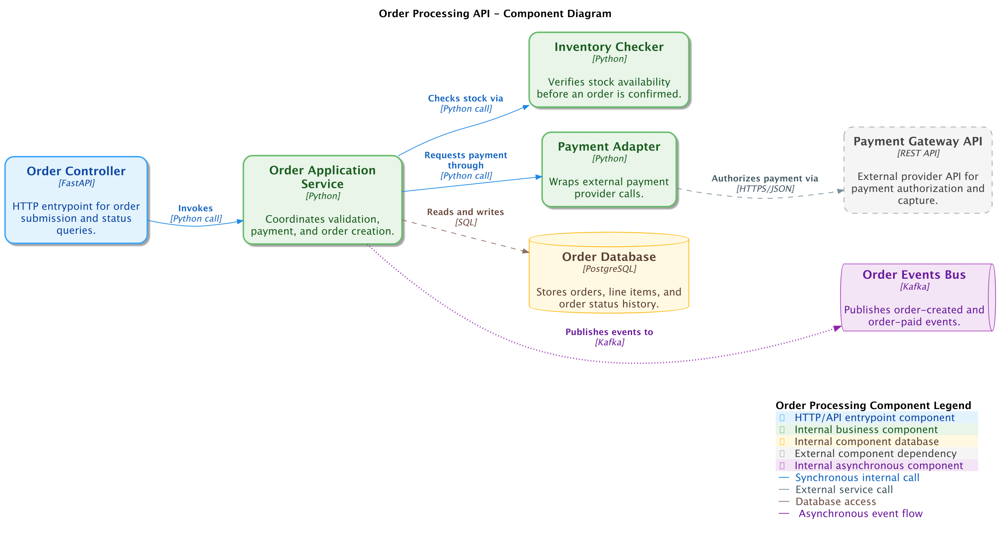

# Component Diagram

A component diagram zooms into one container and shows the major components
inside it. It is aimed at engineers who need to understand responsibilities,
internal dependencies, and how a container connects back to neighboring
containers and external systems.

## Supported DSL Classes

Use [`ComponentDiagram`][c4.diagrams.component.ComponentDiagram] with:

- [`Component`][c4.diagrams.component.Component],
  [`ComponentDb`][c4.diagrams.component.ComponentDb],
  [`ComponentQueue`][c4.diagrams.component.ComponentQueue], and external
  variants
- surrounding [`Container`][c4.diagrams.container.Container] and
  [`ContainerDb`][c4.diagrams.container.ContainerDb] elements for dependencies
- [`ContainerBoundary`][c4.diagrams.container.ContainerBoundary] for the
  container being decomposed
- portable [`Rel`][c4.diagrams.core.relationships.Rel]

## Portable Example

```python
from c4 import Component, ComponentDiagram, Container, ContainerBoundary, Rel, SystemExt


with ComponentDiagram(title="Backend API components") as diagram:
    spa = Container("Single Page Application", "Browser UI.", "React")
    payments = SystemExt("Payment Gateway", "Authorizes payments.")

    with ContainerBoundary("Backend API"):
        checkout = Component("Checkout Controller", "Accepts checkout requests.")
        payment_client = Component("Payment Client", "Calls the payment API.")

    spa >> Rel("Submits checkout", "JSON/HTTPS") >> checkout
    checkout >> Rel("Uses") >> payment_client
    payment_client >> Rel("Authorizes card", "REST API") >> payments

plantuml_source = diagram.as_plantuml()
mermaid_source = diagram.as_mermaid()
```

## PlantUML enhanced example

???+ warning "Non-portable PlantUML example"

    This snippet uses PlantUML extension data and renderer options. Render it
    with the PlantUML rendering backend when keeping those hints.

The generated PlantUML example demonstrates the same component model with
PlantUML render options and source output.

```python
--8<-- "assets/examples/plantuml/component-diagram.py"
```

## Renderer Behavior

PlantUML supports C4-PlantUML component rendering, tags, styles, legends, and
layout hints. Mermaid renders the common component subset, but Mermaid C4 is
less expressive and may require Mermaid-specific style offsets for readable
labels.

## Generated Source and Image

<details>
<summary>Generated PlantUML source</summary>

```puml
--8<-- "assets/examples/plantuml/component-diagram.puml"
```

</details>


