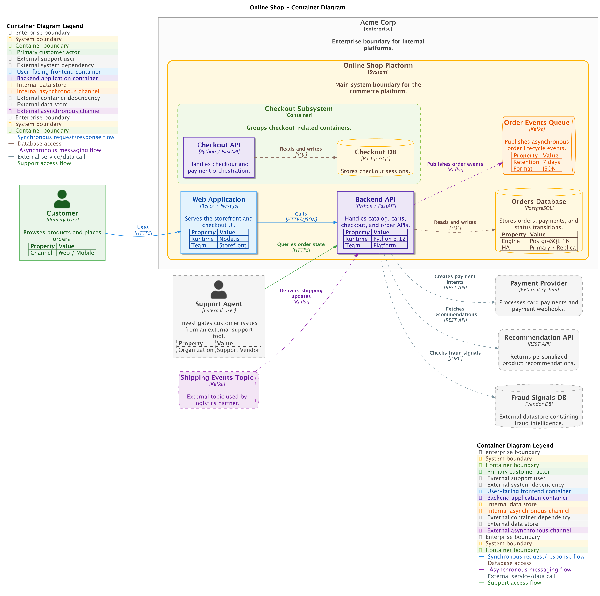

# Container Diagram

A container diagram zooms into one software system and shows its applications,
data stores, message brokers, and other deployable or runnable parts. It is
most useful for software developers, operators, and technical stakeholders who
need to understand responsibilities, technology choices, and communication
paths.

## Supported DSL Classes

Use [`ContainerDiagram`][c4.diagrams.container.ContainerDiagram] with:

- [`Person`][c4.diagrams.system_context.Person] and external people
- [`Container`][c4.diagrams.container.Container],
  [`ContainerDb`][c4.diagrams.container.ContainerDb],
  [`ContainerQueue`][c4.diagrams.container.ContainerQueue], and external
  variants
- [`SystemBoundary`][c4.diagrams.system_context.SystemBoundary] for the system
  being decomposed
- [`ContainerBoundary`][c4.diagrams.container.ContainerBoundary] when you need
  a portable boundary around grouped containers
- portable [`Rel`][c4.diagrams.core.relationships.Rel]

???+ warning "Containers with nested elements"

    C4-PlantUML containers can visually act like boundaries and contain nested
    elements. The portable DSL keeps containers and boundaries as separate
    concepts so the model behaves consistently across renderers.

    Use [`ContainerBoundary`][c4.diagrams.container.ContainerBoundary] for
    portable grouping. Renderer-specific container nesting may be added later
    as a backend extension; it should not be treated as portable C4 model data.

## Portable Example

```python
from c4 import Container, ContainerDb, ContainerDiagram, Person, Rel, SystemBoundary


with ContainerDiagram(title="Retail Platform containers") as diagram:
    customer = Person("Customer", "Places orders through the storefront.")

    with SystemBoundary("Retail Platform"):
        web = Container("Web Application", "Serves the storefront.", "Next.js")
        api = Container("Backend API", "Handles checkout and orders.", "Python")
        db = ContainerDb("Orders Database", "Stores order data.", "PostgreSQL")

    customer >> Rel("Uses", "HTTPS") >> web
    web >> Rel("Calls", "JSON/HTTPS") >> api
    api >> Rel("Reads and writes", "SQL") >> db

plantuml_source = diagram.as_plantuml()
mermaid_source = diagram.as_mermaid()
```

## PlantUML enhanced example

???+ warning "Non-portable PlantUML example"

    This snippet uses PlantUML extension data and helpers. Render it with the
    PlantUML rendering backend, or remove those hints before targeting Mermaid.

The generated PlantUML example uses element tags, layout helpers, and a legend.
Tags are passed with `plantuml={...}` and layout helpers are imported from
`c4.contrib.plantuml`.

```python
--8<-- "assets/examples/plantuml/container-diagram.py"
```

## Renderer Behavior

PlantUML supports C4-PlantUML container rendering, tags, styles, legends, and
layout hints. Mermaid can render the portable container model and Mermaid style
options, but it does not understand PlantUML-only layout helpers, sprites, or
PlantUML tag styling.

## Generated Source and Image

<details>
<summary>Generated PlantUML source</summary>

```puml
--8<-- "assets/examples/plantuml/container-diagram.puml"
```

</details>


