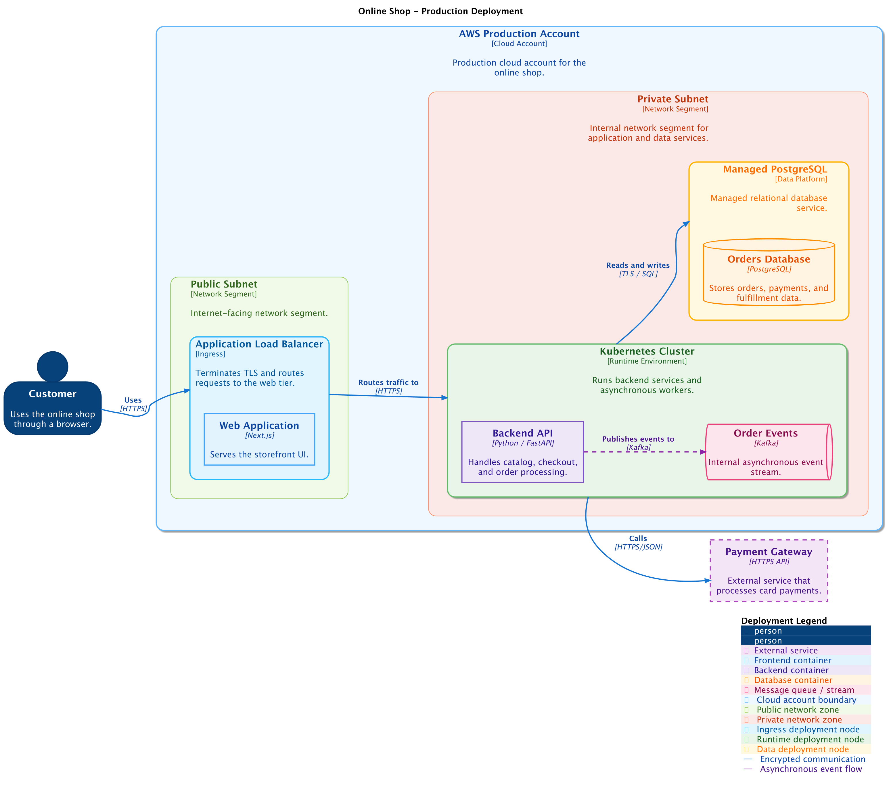

# Deployment Diagram

A deployment diagram shows how software systems or containers are deployed onto
infrastructure for an environment such as production, staging, or development.
It is useful for developers, platform engineers, and operations teams who need
to understand runtime topology and network boundaries.

## Supported DSL Classes

Use [`DeploymentDiagram`][c4.diagrams.deployment.DeploymentDiagram] with:

- [`Node`][c4.diagrams.deployment.Node] for a generic infrastructure boundary
- [`DeploymentNode`][c4.diagrams.deployment.DeploymentNode] for a C4 deployment
  node such as a device, server, runtime, cluster, or managed service
- [`Container`][c4.diagrams.container.Container],
  [`ContainerDb`][c4.diagrams.container.ContainerDb], and queue variants for
  deployed software
- portable [`Rel`][c4.diagrams.core.relationships.Rel]

`Node` and `DeploymentNode` are portable deployment model classes. Layout
variants live in contrib packages: `NodeLeft` and `NodeRight` in
`c4.contrib.c4_macros`, and `DeploymentNodeLeft` and `DeploymentNodeRight` in
`c4.contrib.plantuml`.

## Portable Example

```python
from c4 import Container, ContainerDb, DeploymentDiagram, DeploymentNode, Rel


with DeploymentDiagram(title="Retail production deployment") as diagram:
    with DeploymentNode("Production Cloud Account"):
        with DeploymentNode("Kubernetes Cluster"):
            api = Container("Backend API", "Handles checkout.", "Python")

        with DeploymentNode("Managed PostgreSQL"):
            db = ContainerDb("Orders Database", "Stores orders.", "PostgreSQL")

    api >> Rel("Reads and writes", "TLS / SQL") >> db

plantuml_source = diagram.as_plantuml()
mermaid_source = diagram.as_mermaid()
```

## PlantUML enhanced example

???+ warning "Non-portable PlantUML example"

    This snippet uses PlantUML extension data, node variants, and layout
    helpers. Render it with the PlantUML rendering backend when keeping those
    hints.

The generated PlantUML example uses node tags, directional node variants,
layout helpers, relationship styling, and a legend.

```python
--8<-- "assets/examples/plantuml/deployment-diagram.py"
```

## Renderer Behavior

PlantUML has the most complete deployment support because C4-PlantUML provides
deployment node rendering, left/right node variants, tags, sprites, and layout
hints. Mermaid can render deployment-like nested nodes from the portable model,
but Mermaid C4 support is experimental and lower fidelity for complex
infrastructure topologies.

## Generated Source and Image

<details>
<summary>Generated PlantUML source</summary>

```puml
--8<-- "assets/examples/plantuml/deployment-diagram.puml"
```

</details>


