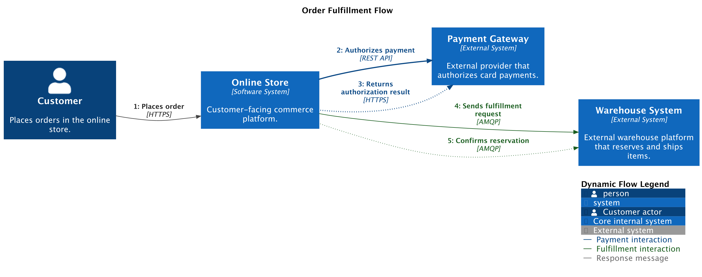

# Dynamic Diagram

A dynamic diagram shows how existing elements collaborate at runtime to
implement a user story, use case, or feature. It is aimed at readers who need
to understand interaction order without switching to a full sequence diagram.

## Supported DSL Classes

Use [`DynamicDiagram`][c4.diagrams.dynamic.DynamicDiagram] with the element
classes that participate in the runtime flow:

- people, systems, containers, components, and their external variants
- boundaries when they help locate the participating elements
- portable [`Rel`][c4.diagrams.core.relationships.Rel]

The portable model records relationships in declaration order. PlantUML dynamic
index helpers such as `Index`, `LastIndex`, and `SetIndex` are backend-owned
helpers from [`c4.contrib.plantuml`](../renderers/plantuml/dynamic-indexes.md),
not portable core features.

## Portable Example

```python
from c4 import DynamicDiagram, Person, Rel, System, SystemExt


with DynamicDiagram(title="Checkout flow") as diagram:
    customer = Person("Customer", "Places an order.")
    store = System("Online Store", "Accepts checkout requests.")
    payments = SystemExt("Payment Gateway", "Authorizes card payments.")

    customer >> Rel("1. Places order", "HTTPS") >> store
    store >> Rel("2. Authorizes payment", "REST API") >> payments
    payments >> Rel("3. Returns authorization result", "HTTPS") >> store

plantuml_source = diagram.as_plantuml()
mermaid_source = diagram.as_mermaid()
```

## PlantUML enhanced example

???+ warning "Non-portable PlantUML example"

    This snippet uses PlantUML-only relationship direction, layout, styling,
    and index hints. Render it with the PlantUML rendering backend when keeping
    those hints.

The generated PlantUML example uses PlantUML-only relationship direction,
layout, styling, and explicit relationship indexes.

```python
--8<-- "assets/examples/plantuml/dynamic-diagram.py"
```

## Renderer Behavior

PlantUML supports C4-PlantUML dynamic relationship indexes through
`plantuml={"index": ...}` and helper values from `c4.contrib.plantuml`.
Mermaid can render the common elements and relationships, but it does not
support PlantUML dynamic index helpers or PlantUML layout helpers.

## Generated Source and Image

<details>
<summary>Generated PlantUML source</summary>

```puml
--8<-- "assets/examples/plantuml/dynamic-diagram.puml"
```

</details>


