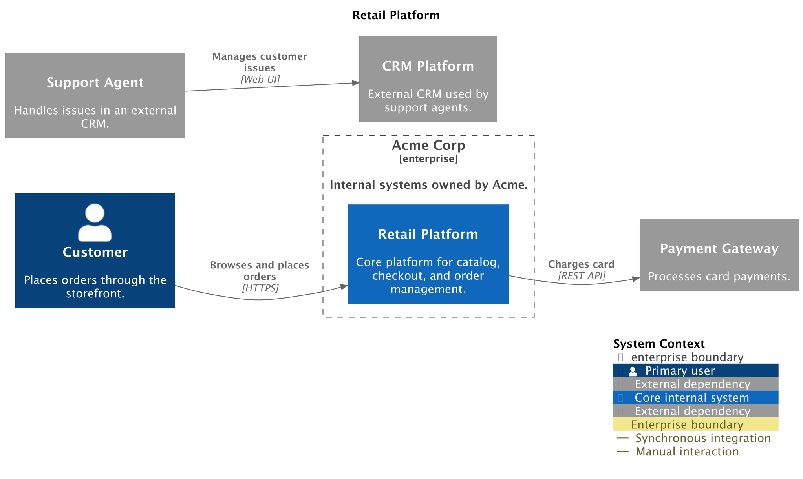

# System Context Diagram

A system context diagram shows one software system in its environment. It is
usually the first C4 view for a product or service, and is aimed at both
technical and non-technical readers who need to understand users, neighboring
systems, and major integrations.

## Supported DSL Classes

Use [`SystemContextDiagram`][c4.diagrams.system_context.SystemContextDiagram]
with people, systems, system boundaries, and enterprise boundaries:

- [`Person`][c4.diagrams.system_context.Person] and
  [`PersonExt`][c4.diagrams.system_context.PersonExt]
- [`System`][c4.diagrams.system_context.System],
  [`SystemExt`][c4.diagrams.system_context.SystemExt],
  [`SystemDb`][c4.diagrams.system_context.SystemDb], and queue variants
- [`SystemBoundary`][c4.diagrams.system_context.SystemBoundary] and
  [`EnterpriseBoundary`][c4.diagrams.system_context.EnterpriseBoundary]
- portable [`Rel`][c4.diagrams.core.relationships.Rel]

PlantUML relationship direction helpers and layout helpers are available from
[`c4.contrib.plantuml`](../renderers/plantuml/layout.md), but they are
PlantUML-specific rendering hints rather than portable model data.

## Portable Example

```python
from c4 import Person, Rel, System, SystemContextDiagram, SystemExt


with SystemContextDiagram(title="Retail Platform context") as diagram:
    customer = Person("Customer", "Places orders through the storefront.")
    retail = System("Retail Platform", "Catalog, checkout, and order management.")
    payments = SystemExt("Payment Gateway", "Processes card payments.")

    customer >> Rel("Browses and places orders", "HTTPS") >> retail
    retail >> Rel("Charges card", "REST API") >> payments

plantuml_source = diagram.as_plantuml()
mermaid_source = diagram.as_mermaid()
```

## PlantUML enhanced example

???+ warning "Non-portable PlantUML example"

    This snippet uses PlantUML extension data and helpers. Render it with the
    PlantUML rendering backend, or remove those hints before targeting Mermaid.

The generated PlantUML example adds tags, links, layout hints, and a legend.
Those features are owned by the PlantUML rendering backend and use
`plantuml={...}` data or helpers from `c4.contrib.plantuml`.

```python
--8<-- "assets/examples/plantuml/system-context-diagram.py"
```

## Renderer Behavior

PlantUML supports the richest system-context output, including external element
rendering, tags, sprites, links, relationship styling, legends, and layout hints.
Mermaid can render the portable model and Mermaid-specific styling, but Mermaid
C4 syntax is experimental and does not support PlantUML layout helpers or
PlantUML dynamic index helpers.

## Generated Source and Image

<details>
<summary>Generated PlantUML source</summary>

```puml
--8<-- "assets/examples/plantuml/system-context-diagram.puml"
```

</details>


