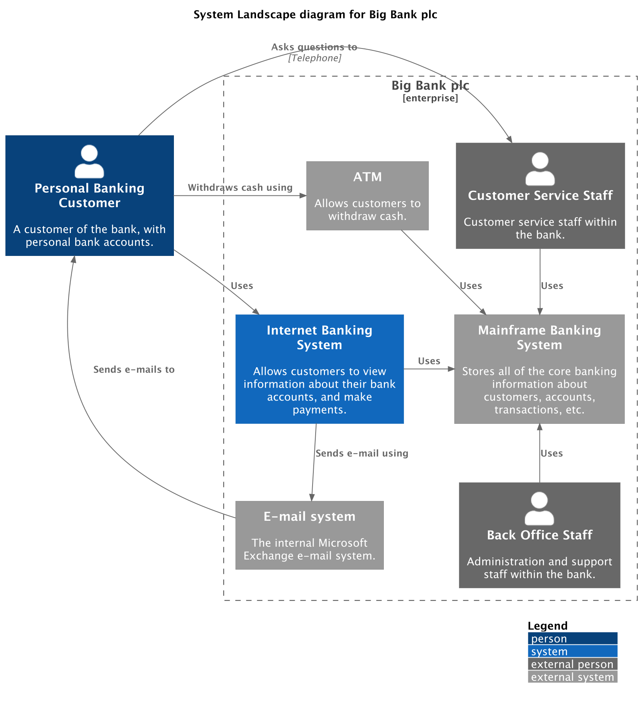

# System Landscape Diagram

A system landscape diagram shows the software systems in an enterprise,
department, or product portfolio. It is useful when the audience needs a map of
several systems rather than a focused view of one system.

## Supported DSL Classes

Use [`SystemLandscapeDiagram`][c4.diagrams.system_context.SystemLandscapeDiagram]
with the same people, systems, boundaries, and portable relationships used by a
system context diagram:

- [`Person`][c4.diagrams.system_context.Person] and
  [`PersonExt`][c4.diagrams.system_context.PersonExt]
- [`System`][c4.diagrams.system_context.System] and external system variants
- [`EnterpriseBoundary`][c4.diagrams.system_context.EnterpriseBoundary] when
  the landscape is scoped to an organization
- portable [`Rel`][c4.diagrams.core.relationships.Rel]

## Portable Example

```python
from c4 import EnterpriseBoundary, Person, Rel, System, SystemExt, SystemLandscapeDiagram


with SystemLandscapeDiagram(title="Retail landscape") as diagram:
    customer = Person("Customer", "Places and tracks orders.")

    with EnterpriseBoundary("Acme Corp"):
        retail = System("Retail Platform", "Online catalog and checkout.")
        warehouse = System("Warehouse System", "Reserves and ships stock.")

    payments = SystemExt("Payment Gateway", "Processes card payments.")

    customer >> Rel("Uses", "HTTPS") >> retail
    retail >> Rel("Requests fulfillment", "Events") >> warehouse
    retail >> Rel("Charges card", "REST API") >> payments

plantuml_source = diagram.as_plantuml()
mermaid_source = diagram.as_mermaid()
```

## PlantUML enhanced example

???+ warning "Non-portable PlantUML example"

    This snippet uses PlantUML relationship direction and layout helpers.
    Render it with the PlantUML rendering backend when keeping those hints.

PlantUML relationship direction helpers and layout helpers can make a crowded
landscape easier to read. Import them from `c4.contrib.plantuml` and keep them
out of portable examples.

```python
from c4 import EnterpriseBoundary, Person, PersonExt, System, SystemExt, SystemLandscapeDiagram
from c4.contrib.plantuml import LayD, LayU, RelBack, RelD, RelNeighbor, RelR, RelU
from c4.renderers.plantuml import PlantUMLRenderOptionsBuilder


with SystemLandscapeDiagram(title="System Landscape diagram for Big Bank plc") as diagram:
    customer = Person(
        "Personal Banking Customer",
        "A customer of the bank, with personal bank accounts.",
        alias="customer",
    )

    with EnterpriseBoundary("Big Bank plc", alias="c0"):
        banking_system = System(
            "Internet Banking System",
            "Allows customers to view information about their bank accounts, and make payments.",
            alias="banking_system",
        )
        atm = SystemExt("ATM", "Allows customers to withdraw cash.", alias="atm")
        mail_system = SystemExt(
            "E-mail system",
            "The internal Microsoft Exchange e-mail system.",
            alias="mail_system",
        )
        mainframe = SystemExt(
            "Mainframe Banking System",
            "Stores all core banking information.",
            alias="mainframe",
        )
        customer_service = PersonExt(
            "Customer Service Staff",
            "Customer service staff within the bank.",
            alias="customer_service",
        )
        back_office = PersonExt(
            "Back Office Staff",
            "Administration and support staff within the bank.",
            alias="back_office",
        )

    customer >> RelNeighbor("Uses") >> banking_system
    customer >> RelR("Withdraws cash using") >> atm
    customer >> RelBack("Sends e-mails to") >> mail_system
    customer >> RelR("Asks questions to", "Telephone") >> customer_service
    banking_system >> RelD("Sends e-mail using") >> mail_system
    atm >> RelR("Uses") >> mainframe
    banking_system >> RelR("Uses") >> mainframe
    customer_service >> RelD("Uses") >> mainframe
    back_office >> RelU("Uses") >> mainframe

    LayD(atm, banking_system)
    LayD(atm, customer)
    LayU(mail_system, customer)

    render_options = PlantUMLRenderOptionsBuilder().layout_with_legend().build()

diagram_code = diagram.as_plantuml(render_options=render_options)
```

## Renderer Behavior

PlantUML renders system landscapes with the same C4-PlantUML context mapping
used for system context diagrams. Mermaid can render the portable model, but
large landscapes often need Mermaid-specific layout tuning because Mermaid does
not support PlantUML layout helpers.

## Generated Source and Image

<details>
<summary>Generated PlantUML source</summary>

```puml
--8<-- "assets/examples/plantuml/system-landscape-diagram.puml"
```

</details>


