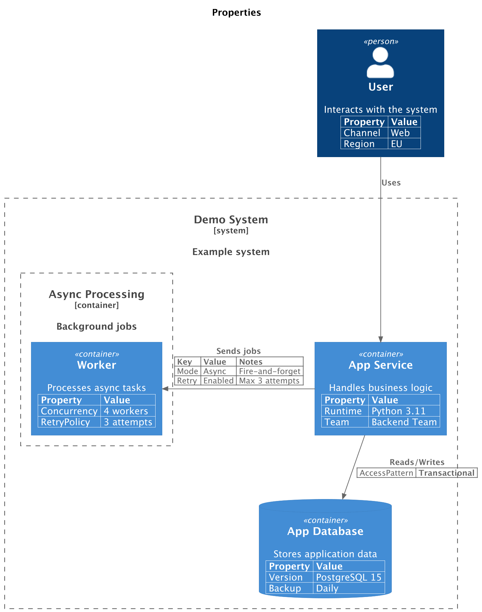

# PlantUML Properties

PlantUML renders portable C4 properties as C4-PlantUML property tables. See the
[Properties](../properties.md) page for the property API.

This example adds properties to elements and relationships:

```python
from c4 import (
    Container,
    ContainerBoundary,
    ContainerDb,
    ContainerDiagram,
    Person,
    Rel,
    SystemBoundary,
)
from c4.contrib.plantuml import RelLeft


with ContainerDiagram(title="Properties") as diagram:
    user = Person("User", "Interacts with the system")
    user.add_property("Channel", "Web")
    user.add_property("Region", "EU")

    with SystemBoundary("Demo System", "Example system"):
        app = Container("App Service", "Handles business logic")
        app.add_property("Runtime", "Python 3.11")
        app.add_property("Team", "Backend Team")

        db = ContainerDb("App Database", "Stores application data")
        db.add_property("Version", "PostgreSQL 15")
        db.add_property("Backup", "Daily")

        with ContainerBoundary("Async Processing", "Background jobs"):
            queue = Container("Worker", "Processes async tasks")
            queue.add_property("Concurrency", "4 workers")
            queue.add_property("RetryPolicy", "3 attempts")

    user_app_rel = user >> Rel("Uses") >> app

    app_queue_rel = app >> RelLeft("Sends jobs") >> queue
    app_queue_rel.set_property_header("Key", "Value", "Notes")
    app_queue_rel.add_property("Mode", "Async", "Fire-and-forget")
    app_queue_rel.add_property("Retry", "Enabled", "Max 3 attempts")

    app_db_rel: Rel = app >> Rel("Reads/Writes") >> db
    app_db_rel.add_property("AccessPattern", "Transactional")
    app_db_rel.without_property_header()
```

<br/>

This produces the following diagram:

<figure markdown="span">

  

  <figcaption></figcaption>

</figure>

## Supported elements

Properties can be added to diagram elements and relationships supported by
C4-PlantUML. They are emitted as C4-PlantUML property macros before the target
element or relationship.
